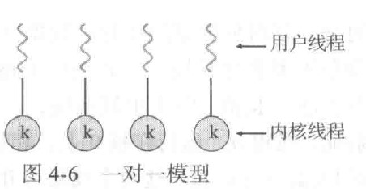

# <center> 操作系统概念 </center>

## <center>    noted by zyh-hehe   </center>

##  <center> BUPT SCS 2022</center>


### 第一章 导论

#### 1.1 操作系统的功能

##### 一. 计算机系统的组件：硬件、操作系统、应用程序、用户

1. 硬件：为系统提供基本的计算资源
2. 应用程序：规定用户为解决计算问题而使用这些资源的方式
3. 操作系统：控制硬件，并协调各个用户应用程序的硬件使用


##### 二. 用户视角

1. 单个用户单独使用资源：优化用户进行的工作。设计主要目的是用户使用方便，次要的是性能，不在乎的是资源利用（如何共享硬件和软件资源）
2. 多个用户共享资源并可以交换信息：设计主要目的是优化资源利用率，确保所有的cpu时间、内存和IO都能得到有效使用，并且确保没有用户使用超过限额以外的资源
3. 工作站模式，工作站和其他工作站和服务器相连，用户不仅可以使用专用资源，而且可以使用网络和服务器的共享资源：设计需要兼顾使用方便性和资源利用率

##### 三. 系统视角

1. 从计算机的角度来看，操作系统是与硬件紧密相连的程序。因此可以将操作系统看作资源分配器。
2. 计算机系统的资源：cpu时间、内存空间、文件存储空间、IO设备等。
3. 控制程序角度：强调控制各种IO设备和用户程序的需求，操作系统作为控制程序管理用户程序的执行，以防止计算机资源的错误或不当使用。特别注重IO设备的运行和控制。

##### 四. 操作系统的定义

1. 一个比较公认的定义是，**操作系统是一直运行在计算机上的程序（内核/kernel）**。（除了内核外，还有其他的两类程序：系统程序和应用程序。前者是与系统运行有关的程序，但不是内核的一部分；后者是与系统运行无关的所有其他程序）
2. 移动操作系统通常不只有内核，也有中间件，即为应用程序开发人员提供其他功能（如数据、多媒体和图形等）的软件框架。

#### 1.2 计算机系统的组成

##### 一. 计算机系统的运行

1. 现代通用计算机系统包括**一个或多个cpu**和**若干设备控制器**，通过**公用总线**相连而成，该总线提供了共享内存的访问。每个设备控制器负责一类特定的设备。cpu和设备控制器可以并发执行，并且竞争访问内存。为了确保有序访问共享内存，需要内存控制器来协调访问内存。

   

2. 当计算机开始运行时，它需要运行一个**初始程序**。该初始程序/引导程序一般位于计算机的固件（如ROM或EEPROM）。它初始化系统的各个组件，从cpu寄存器、设备控制器到内存内容。引导程序必须知道如何加载操作系统并且开始执行系统，所以**其必须定位操作系统内核并且加到内存**。

3. 一旦内核**加到内存并执行**，它就开始为系统和用户提供服务。除了内核外，系统程序也提供一些服务，它们在启动时加到内存而成为系统进程/系统后台程序，其生命周期与内核一样。对于UNIX，首个系统进程为”init“，它允许许多其他系统后台程序。一旦这个阶段完成了，系统就完全启动了，并且等待事件发生。

4. 事件发生通常通过软硬件的中断来通知。硬件可以随时通过系统总线发送信号到cpu以触发中断，而软件也可通过执行特别操作即系统调用（监督程序调用）以触发中断。

##### 二. 存储结构


##### 三. IO结构

1. 通用计算机系统包括一个或多个cpu和若干设备控制器，通过公用总线相连而成，每个设备控制器负责一类特定的设备。每个设备控制器维护一定量的本地缓冲存储和一组特定用途的寄存器。设备控制器负责在所控制的外围设备与本地缓冲存储之间进行数据传递。操作系统为每个设备控制器提供一个设备驱动程序，该程序负责设备控制器并为操作系统的其他部分提供统一的设备访问接口。
2. 在开始IO时，设备驱动程序加载设备控制器的适当寄存器。相应的，设备控制器检查这些寄存器内容并决定采取什么操作（如读取字符）。控制器开始从设备向本地缓冲区传输数据。一旦完成数据传输，设备控制器就会发出中断表明操作完成，然后驱动程序将控制返回到操作系统。对于读操作，数据或数据指针也会返回；对于其他操作，返回状态信息。
3. DMA：设备控制器可在本地缓冲和内存之间传送整块的数据而无需cpu的干预。


#### 1.3 计算机系统的体系结构

##### 一. 单处理器系统

1. 单处理器系统只有一个主cpu以便执行一个通用指令集，该指令集包括执行用户进程的指令。几乎所有单处理器系统都带有其他专用处理器（如IO处理器等）。这些专用处理器执行有限指令集，而且不执行用户进程。在有的环境下，它们由操作系统管理，操作系统将要做的任务信息发给它们并监控他们的状态。在其他的环境下，专用处理器作为底层组件集成到硬件。操作系统不能和这些处理器通信，但它们可以自主完成任务。要注意的一点是，**如果系统只有一个通用cpu，那么就为单处理器系统**。

##### 二. 多处理器系统

1. 多处理器系统有两个或多个紧密通信的cpu，它们共享计算机总线，有的还共享时钟、内存和外设等。
2. 多处理器系统的优点：增加吞吐量、规模经济、增加可靠性。
   - 增加吞吐量：通过增加处理器数量，能够在更短时间内完成更多工作。采用N个处理器的加速比小于N（**阿姆达尔定律**）。
   - 规模经济：多处理器系统可以共享外设、大容量存储和电源供给。
   - 增加可靠性：将功能分布在多个处理器上，单个处理器的失灵不会使整个系统停止，而只会变慢。
3. 适度退化和容错：根据剩余有效硬件的级别按比例提供服务的能力称为**适度退化**。有的系统超过适度退化，称为容错，因为它们能容忍单个部件错误并且仍然继续运行。容错需要一定的机制来对故障进行检测、诊断和纠错
4. 非对称处理：每个处理器都有各自特定的任务，一个主处理器控制系统，其他处理器或向主处理器要任务或做预先规定的任务。这种方案称为主从关系，即主处理器调度从处理器并安排工作。
5. <a name="SMP">对称多处理（SMP）</a>：每个处理器都参与完成操作系统的所有任务。每个处理器都有自己的寄存器集，也有私有或本地缓存；但所有处理器都共享物理内存。


6. 对称和非对称处理的差异可能源于硬件或者软件。特定硬件可以区别多个处理器，软件也可编成选择一个处理器为主，其他的为从。
7. **多处理通过增加cpu来提高计算能力**。如果cpu集成了内存控制器，那么增加cpu也能增大系统的内存访问。无论如何，多处理可使系统的内存访问模型从均匀内存访问（UMA）改成非均匀内存访问（NUMA）。对于UMA，cpu访问RAM的所需时间相同；而对NUMA，有的内存访问所需时间更多，这会降低性能。操作系统通过资源管理可以改善NUMA的问题。
8. 多核设计：集成多个计算核到单个芯片。多核比多个单核更加高效，因为单片通信比多个芯片通信更快，且电源消耗更低。要注意的是，多核系统为多处理器系统，但不是所有多处理器系统都是多核的
9. 刀片服务器：将多处理器板、IO板和网络板全部置于同一机箱。和传统多处理器系统不同的是，每个刀片服务器可以独立启动，并且运行各自的操作系统。

##### 三. 集群系统

1. 与多处理器系统不同，集群系统由两个或多个独立系统（或节点）组成。这样的系统是**松耦合**的，每个节点可为单处理器系统或多核系统。集群系统较为公认的定义是，集群计算机共享存储，并且采用局域网连接或更快的内部连接。
2. 集群通常**用于提供高可用性服务**，这意味着即使集群中的一个或多个系统出错，仍可继续提供服务。一般来说，通过在系统中增加一定冗余可获取高可用性，每个集群节点都可执行集群软件层，以监视（通过局域网）一个或多个其他节点。如果被监视的机器失效，那么监视机器可以取代存储的拥有权并重启在失效机器上运行的应用程序。用户只会感到短暂的服务中止。
3. 集群可以是对称的或非对称的。对于**非对称集群**，一台机器处于热备份模式，而另一台运行应用程序，热备份主机只监视活动服务器。对于**对称集群**，两个或多个主机都运行应用程序并互相监视。这种方式充分使用现有硬件，当有多个应用程序可供执行时，这种结构更为高效。
4. 集群也可以提供高性能计算环境。每个集群的所有计算机可以并发执行一个应用程序，提供更强大的计算能力。这种技术就是**并行计算**，即将一个程序分为多个部分，而每个部分可以并行运行在计算机或集群计算机的各个核上。每个集群节点解决部分问题，结果合并形成最终解决方案。
5. 其它形式的集群：并行集群允许多个主机访问共享存储的统一数据。

#### 1.4 操作系统的结构

##### 一. 多道程序设计

1. 单个程序不会一直占用cpu和IO设备，多道程序设计通过**合理安排作业**提高cpu利用率。
2. 操作系统会在内存中保存多个任务，但主存太小不能容纳所有作业，因此这些作业会保存在硬盘的**作业池**上，等待分配内存。
3. **内存的作业集**是作业池的作业集的子集。操作系统可以从其中选择执行一个作业。当这个作业需要等待时，cpu可以简单切换到另一个作业。

##### 二. 分时系统

1. 分时系统又称多任务，是多道程序设计的自然延伸。
2. 还是通过cpu切换作业来执行多个作业，但切换频率很高，用户可以在程序运行时与其交互。
3. 允许多个用户共享一台计算机。由于每个动作一般较短，所以每个用户只需要少量cpu时间。系统在用户之间快速切换，实现了每个用户都感觉整个系统为自己所用。
4. 对于分时系统，操作系统必须**确保合理的响应时间**。这可以通过交换实现，但更好的实现方式是虚拟内存。

#### 1.5 操作系统的执行

##### 一. 双重模式与多重模式的执行

1. 为了确保操作系统正确运行，必须区分操作系统代码和用户代码的执行。大多数计算机系统采用**硬件支持**来区分执行模式。

2. 常见的两种单独运行模式是用户模式和内核模式（监视模式、系统模式、特权模式）。**硬件可以通过一个模式位（0/1）区分两种模式。**执行用户程序时系统处于用户模式，但用户程序通过系统调用请求操作系统服务时，系统就会切换到内核模式。

   

3. 双重模式提供保护的手段是将可能引起损害的机器指令作为**特权指令**，并且硬件只有在**内核模式**才能执行这些特权指令。如果在**用户模式**下试图执行特权指令，硬件不会执行，而是认为其非法并**以陷阱形式通知操作系统**。操作系统会给出一个适当的出错信息，并倒出程序内存，写到文件以供检查。

4. 特权指令包括**切换到用户模式，IO控制，定时器管理和中断管理**等。（切换到内核模式是可以由用户程序来执行的，所以不是特权指令）

5. 系统调用有多种方式，但无论哪种方式都是进程请求操作系统执行功能的方法。系统调用会**陷入（trap指令）**中断向量指定的某个位置。当要执行系统调用时，硬件会将其当成软件中断（陷阱），控制经中断向量转移到系统的中断服务程序。内核检查中断指令（的参数）并判断系统调用类型。请求的其他信息可以通过寄存器、堆栈和内存进行传递。内核检查参数是否合法并执行请求。最后，**控制返回到系统调用之后的指令。**

##### 二. 定时器

1. 为防止用户程序陷入死循环或在不调用系统服务时不将控制返回到操作系统，操作系统使用了定时器。定时器可设置为在指定周期后中断计算机。**周期可以是可变或固定的。**
2. 在将控制交到用户之前，操作系统要确保定时器已经设置好以便产生中断。**当定时器中断时，控制自动转到操作系统。**操作系统可以决定将该中断作为错误处理，或是给程序更多时间。

#### 1.6 进程管理

1. 进程为了完成任务，需要一定的资源，包括cpu时间、内存、文件、IO设备等。这些资源可以在进程创建时赋予，也可以在执行进程时分配。当进程中止时，操作系统会收回所有可以再利用的资源。
2. <a href="#difference_between_process_and_procedure">程序本身不是进程</a>。**程序是一个被动实体，进程是一个主动实体。**
3. 进程是系统的工作单元，系统由多个进程组成，包括操作系统进程和用户进程。
4. 操作系统负责以下活动：在cpu上调度进程和线程、创建和删除用户和系统进程、挂起和重启进程、提供进程同步和通信机制。

#### 1.7 内存管理

1. 如果一个程序需要执行，那么它必须**映射到绝对地址并加载到内存**。随着程序执行，进程可以通过产生绝对地址来访问内存的程序指令和数据。程序终止时它的内存会释放，一边后续程序的加载和执行。
2. 内存管理的方案需要有特定算法以适用于特定场景。每个算法都需要特定的硬件支持。
3. 操作系统负责以下活动：记录内存的哪部分在被使用以及被谁使用、决定哪些进程会调入调出内存、根据需要分配和释放内存空间。

#### 1.8 存储管理

1. 文件管理：创建和删除文件、创建和删除目录（以组织文件）、提供文件和目录的操作原语、映射文件到外存、备份文件到稳定非易失的存储介质。
2. 大容量存储器管理：管理空闲空间、存储空间分配、硬盘调度。
3. 高速缓存（cache）：慎重选择高速缓存大小和置换策略可以极大提高性能。
4. IO系统：操作系统的目的之一时为用户隐藏具体硬件设备的特性。

#### 1.9 保护与安全

1. 需要有机制确保只有经过操作系统授权，进程才能使用相应资源。这种机制就是**保护**。
2. 防止系统不受内部或外部攻击是**安全**的工作。为了阻止攻击，有些系统让操作系统完成，其他系统让策略或额外软件来完成。
3. 保护和安全要求系统能区分所有用户。大多数操作系统采用一个列表，以便维护用户名称及其关联用户标识。也有系统区分用户集合。

### 第二章 操作系统结构

####  2.1 操作系统的服务

1. 操作系统提供环境以便执行程序。有一组服务**用于提供用户功能**：
   - 用户界面：有多种形式，包括命令行界面、批处理界面和图形用户界面。
   - 程序执行：系统加载程序加载程序到内存并加以运行。程序应能结束运行，无论是正常还是不正常。
   - IO操作：程序运行可能需要IO，操作系统必须提供手段以便执行IO。
   - 文件系统操作：读写文件和目录，创建删除文件，搜索文件，列出文件信息。有些操作系统还提供权限管理。
   - 通信：可以通过共享内存或消息交换实现。
   - 错误检测：操作系统需要不断检测错误和更正错误。有时只能停机，有时可以终结出错进程，或返回出错码。
2. 还有一组操作系统服务是为了**确保系统本身运行高效**：
   - 资源分配：为多个作业分配资源。
   - 记账：记录用户使用资源的类型和数量。
   - 保护和安全：保护需要确保可以控制系统资源的全部访问。系统安全保证不受内外部攻击。


#### 2.2 用户与操作系统的界面

##### 一. 命令解释程序

1. 命令解释程序允许用户直接输入命令，以供操作系统执行。有的操作系统内核包括命令解释程序，有的操作系统将其当成一个特殊程序，当用户首次登录或一个任务开始时该程序就会运行。对于有多个可选命令解释程序的系统，解释程序称为壳(shell)。
2. 命令解释程序的主要功能是，获取并执行用户指定的下一条命令。这些命令的实现有两种常用方法：
   - 命令解释程序本身包含代码以执行这些命令。对于这种方法，所能提供命令的数量决定命令解释程序的大小。
   - 通过系统程序实现大多数的命令。命令解释程序不必理解命令，只要通过命令确定一个文件以加载到内存并执行。

##### 二. 图形用户界面

1. 利用桌面概念，即采用基于鼠标的视窗和菜单系统。

##### 三、界面的选择

1. 选择命令行界面或GUI主要取决于个人喜好。
2. 用户界面可随系统的不同甚至系统用户的不同而不同，它通常不属于系统内核。

#### 2.3 系统调用

1. 系统调用提供**操作系统服务接口**。

2. 系统每秒执行成千上万的系统调用，但大多数程序员不会看到这些细节。通常，开发者根据API来设计程序。API为方便应用程序员规定了一组函数，包括每个函数的输入参数和返回值。有三组常见的API：适用于Windows的Windows API、适用于POSIX系统（包括所有版本的UNIX、Linux和OS X）的POSIX API和适用于Java虚拟机的Java API。

3. 在后台，API函数通常为应用程序员调用实际的系统调用。

4. 根据API来编程能够提高程序的可移植性。

5. 对于大多数的程序设计语言，运行时支持系统（函数库）提供了系统调用接口以链接到操作系统的系统调用。系统调用接口截取API函数的调用，并调用所需的系统调用。每个系统调用有一个相关数字，接口根据数字来建立索引列表。

   

   

6. 向操作系统传递参数有三种常用方法：通过寄存器传递参数；将参数存在内存的块或表中，通过寄存器传递地址；将参数压入堆栈，通过操作系统弹出。后两种方式不限制传递参数的数量或长度。

#### 2.4 系统调用的类型

##### 一. 进程控制

1. 执行程序应能正常(end( ))或异常(abort( ))停止执行，如果一个系统调用异常停止当前执行的程序，或程序运行遇到问题并引起错误陷阱，就将内存信息转储到磁盘并生成错误信息，便于纠正错误。**无论是正常还是异常情况，操作系统都应将控制转到命令解释程序。**
2. 执行一个程序的进程或作业可能需要加载(load( ))和执行(execute( ))另一个程序。这种功能允许命令解释程序来执行一个程序。
3. 创建了新的作业或进程后，可能要等待其执行完成，也可能要等待某个事件的出现。
4. 通常，两个或多个进程会共享数据。为了确保共享数据的完整性，操作系统通常提供系统调用以允许一个进程锁定共享数据。在解锁之前，其他进程不能访问该数据。

##### 二. 文件管理

1. 首先要能创建和删除文件。这两个系统调用需要文件名称和文件的一些属性。
2. 一旦文件创建后，就会打开并使用它，也会读、写、重定位。最后，需要关闭文件。
3. 如果采取目录结构组织文件系统的文件，那么也需要同样的目录操作。
4. 不管是文件还是目录，都要能对各种属性的值加以读取或设置。
5. 有的操作系统还提供其他的系统调用，包括文件复制、移动。

##### 三. 设备管理

1. 进程执行需要一些资源。操作系统控制的各种资源可以看作设备。有的设备是物理设备，有的设备可当作抽象或虚拟的设备。多用户系统要求先请求设备，在设备使用完后要释放它。
2. 在请求并得到设备后，就能像对待文件一样对设备进行读、写、重定位。

##### 四. 信息维护

1. 用于**在程序与操作系统之间传递信息**。
2. 大多数系统都有一个返回当前时间和日期的系统调用。还有的系统调用可以返回系统的其他信息，如当前用户数、操作系统版本和内存或磁盘的可用量等。
3. 还有一组系统调用帮助调试程序，包括转储内存、单步（cpu每执行一条指令都会产生一个陷阱）。
4. 操作系统维护所有进程的信息，可以通过系统调用来访问。

##### 五. 通信

1. 对于<a href="#message_communicating_system">消息传递模型</a>，进程通信通过相互交换消息来传递信息。进程间的消息交换可以直接执行，也可通过一个共同邮箱来间接进行。
2. 对于<a href="#shared_memory_system">共享内存模型</a>，进程通过系统调用创建共享内存，并访问其他进程拥有的内存区域。
3. 消息传递对少量数据的交换很有用，共享内存在通信方面比较高速和便捷，但在保护和同步方面有问题。

##### 六. 保护

1. 提供保护的系统调用包括设置资源权限和允许或拒绝特定用户访问某些资源。

#### 2.5 系统程序

1. 系统程序也称为系统工具，为程序开发和执行提供了一个方便的环境。有的系统程序只是系统调用的简单用户接口，有的相当复杂。系统程序可分为：文件管理、状态信息、文件修改、程序语言支持、程序加载与执行、通信、后台服务。
2. 除系统程序外，大多数操作系统提供解决常见问题或执行常用操作的程序，包括网页浏览器、文字处理器、数据库系统、编译器等。

#### 2.6 操作系统的设计与实现

##### 一. 设计目标

1. 用户目标：用户要求系统有一定的优良性能。
2. 系统目标：操作系统应易于设计、实现和维护。

##### 二. 机制和策略

1. **机制决定如何做，策略决定做什么。**一个重要原则就是策略和机制的分离。
2. 对于所有的资源分配，策略决定非常重要。只要决定是否分配资源，就应做出策略决定。

##### 三. 实现

1. 早期系统是用汇编语言编写的，现在大部分操作系统用高级语言实现。实际上，操作系统可以由多种语言编写，底层使用汇编语言，高层使用高级语言。
2. 采用高级语言的优势在于代码编写更快、更为紧凑、更容易理解和调试、更容易移植到其他硬件，缺点在于速度的降低和存储的增加。
3. 操作系统的重大性能改善很可能来源于更好的数据结构和算法。

#### 2.7 操作系统的结构

##### 一. 简单结构

1. 利用最小空间而提供最多功能，因此没有仔细地划分成模块。


##### 二. 分层方法

1. 有了适当的硬件支持，操作系统可以分成许多块，这样操作系统可以更好地控制计算机和使用计算机的应用程序。采用自顶向下方法，可先确定总的功能和特征，再划分成模块。
2. 系统的模块化有许多方法，其中一种是分层法，即操作系统分成若干层级。最低层（层0）是硬件，最高层（层N）是用户接口。操作系统层采取抽象对象，以包括数据和操纵这些数据的操作。如层M，包括了数据结构和一组可被更高层调用的程序集，而层M可以调用更低层的操作。


3. 分层法的优点在于简化了构造和调试，因为每层的实现只是利用更低层的操作。
4. 分层法的难点在于如何合理定义各层。由于每层只能利用更低层的功能，因此有必要仔细规划。同时，由于每层都为系统调用增加了额外开销，分层实现的效率会比其他方法较差。

##### 三. 微内核

1. 微内核技术通过从内核中删除所有不必要的部件，而将他们当作系统级与用户级的程序来实现，以将内核模块化。这样会使内核较小。
2. 微内核的主要功能是为客户端程序和运行在用户空间的各种服务提供通信。通信是通过消息传递来提供的。
3. 微内核的优点是便于扩展操作系统，因为新服务可以在用户空间内添加；当内核确实需要修改时，所做修改也会很小。而且，微内核的可移植性、安全性和可靠性都更好。
4. 微内核的缺点是，由于增加的系统功能的开销，微内核的性能会受损。

##### 四. 模块

1. 操作系统的设计采取**可加载的内核模块形式**。内核有一组核心组件，在启动或运行时，内核都可以**通过模块链入额外服务**。
2. 这种设计的思想是：内核提供核心服务，其他服务可以在内核运行时动态实现。

### 第三章 进程

#### 3.1 进程概念

##### 一. 进程

1. <a name="difference_between_process_and_procedure">**进程是执行的程序，但不只是程序代码。**</a>进程还包括当前活动，如程序计数器的值和处理器寄存器的内容等。另外，进程通常还包括进程堆栈、数据段和堆（进程运行时动态分配的内存）。


2. 虽然两个进程可以与同一程序相关联，但是当作两个单独的执行序列。进程在运行时也经常会生成许多进程。
3. 进程本身也可以作为一个环境，用于执行其他代码。
4. 进程的五大特征：**动态性、异步性、并发性、独立性、结构上是由程序段、数据段和PCB组成的。**

##### 二. 进程状态

1. 每个进程可能处于以下状态：
   - 新的（new）：进程正在创建。
   - 运行（running）：指令正在执行。
   - 等待（waiting）：进程等待发生某个事件（如IO完成或收到信号）。
   - 就绪（ready）：进程等待分配处理器。
   - 终止（terminated）：进程已经完成执行。
   
   

##### 三. 进程控制块（PCB）

1. 操作系统内的每个进程表示，采用**进程控制块（PCB）**，也称为任务控制块。它包含许多与特定进程相关的信息：

   - 进程状态
   - 程序计数器：进程将要执行的下个指令的地址
   - cpu寄存器
   - cpu调度信息：包括进程优先级、调度队列的指针和其他调度参数
   - 内存管理信息：包括基地址、界限寄存器的值、页表或段表
   - 记账信息：包括cpu时间、实际使用时间、时间期限、记账数据、作业或进程数量
   - IO状态信息：包括分配给进程的IO设备列表、打开文件列表

   

##### 四. 线程

   1. 许多现代操作系统扩展了进程概念，以便一次能够执行多个线程。在支持线程的系统中，PCB被扩展到包括每个线程的信息。
   2. **Linux的PCB采用C语言结构体task_struct来表示。**在Linux内核中，所有活动进程的表示都采用task_struct的双向链表。内核采用一个current指针用于指向当前系统正在执行的进程。

#### 3.2 进程调度

##### 一. 调度队列

1. 进程在进入系统时，会被加到**作业队列**，这个队列包括系统内的所有进程。
2. 驻留在内存中的、就绪的、等待运行的进程保存在**就绪队列**上。这个队列通常用链表实现，头节点有两个指针，用于指向链表的第一个和最后一个PCB块；每个PCB块还包括一个指针，指向就绪队列的下一个PCB。
3. 一个共享设备可能会收到多个进程的IO请求，有的进程需要等待。等待特定IO设备的进程列表称为**设备队列**。每个设备都有自己的设备队列。


4. 进程调度通常用队列图来表示。最初，新进程被加到就绪队列并等待，直到被选中执行或分派。当该进程被分配到cpu并执行时，以下事件可能发生：

   - 进程可能发出IO请求，并被放到IO队列。

   - 进程可能创建一个新的子进程，并等待其终止。

   - 进程可能由于中断而被强制释放cpu，并被放回到就绪队列。

   进程会重复以上循环直到终止，然后从所有队列中删除，其PCB和资源也被释放。


##### 二. 调度程序

1. 进程在整个生命周期中会在各种调度队列之间迁移。操作系统为了调度必须按一定方式从这些队列中选择进程。进程选择通过适当调度器或调度程序来执行。主要有两种调度程序：

   - 长期调度程序：又称作业调度程序，从磁盘的缓冲池中选择进程加到内存以便执行。
   - 短期调度程序：又称cpu调度程序，从准备执行的进程中选择进程并分配cpu。

   这两种调度程序的主要区别是执行频率。短期调度程序必须经常为cpu选择新的进程，通常每100ms至少执行一次，这导致短期调度程序必须快速。长期调度程序执行并不频繁，在新进程的创建之间通常有几分钟间隔。

2. 长期调度程序控制**多道程序程度，即内存中的进程数量**。长期调度程序应进行认真选择，保证IO密集型和cpu密集型的合理进程组合，以使系统平衡和性能得到优化。

3. 有的系统可能没有或极少采用长期调度程序，如UNIX和WIndows，只是将新进程放在内存供短期调度程序使用。

4. 有的分时系统可能引入一个额外的**中期调度程序**，其核心思想是可**将进程从内存或cpu竞争中移出，从而降低多道程序程度。**之后，进程可被重新调入内存，并从中断处继续执行。这种方案被称为**交换**。


##### 三. 上下文切换

1. 中断导致cpu从执行当前任务改变到执行内核程序。当中断发生时，系统需要保存当前运行在cpu上的进程的上下文，一百年在处理后能够恢复上下文，即先挂起进程，再恢复进程。进程上下文采用PCB表示。通常，通过执行状态保存保存cpu当前状态（包括模式）；之后，状态恢复重新开始运行。
2. 切换cpu到另一个进程需要保存当前进程状态和恢复另一个进程的状态，这个任务就是上下文切换。当进行上下文切换时，内核会将旧进程状态保存在其PCB中，然后加载经调度而要执行的新进程的上下文。
3. 上下文切换的时间是纯粹的开销，因为切换时系统没有做任何有用工作。其典型速度是几毫秒。

#### 3.3 进程运行

##### 一. 进程创建

1. 进程再执行过程中可能创建多个新的进程。**创建进程称为父进程，新进程称为子进程。**每个新进程可以再创建其他进程，从而形成进程树。

2. 大多数操作系统对进程的识别是采用唯一的**进程标识符（pid）**，这通常是一个整数值。系统内的每个进程都有一个唯一的pid，它可以用做索引，以便访问内核中进程的各种属性。

3. Linux系统中，**进程init（pid始终为1）作为所有用户进程的根进程或父进程**。一旦系统启动后，init进程可以创建各种用户进程。对于UNIX和Linux系统，我们可以通过ps命令得到一个进程列表。

4. 当一个进程创建子进程时，子进程所需的资源可以从操作系统直接获得，也可以只从父进程那里获得资源子集。父进程可能要在子进程之间分配资源或共享资源，限制子进程只能使用父进程的资源，可以防止创建过多进程，导致系统超载。除了提供各种物理和逻辑资源外，父进程也可能向子进程传递初始化数据或输入。

5. 当进程创建新进程时，可能有两种执行可能：

   - 父进程与子进程并发执行
   - 父进程等待，直到某个或全部子进程执行完。

   新进程的地址空间也有两种可能：

   - 子进程是父进程的复制品，两者有同样的数据和程序
   - 子进程加载另一个新程序

6. 在UNIX中，通过系统调用fork() 可创建新进程。新进程的地址空间复制了原来进程的地址空间，这使得父进程和子进程可以轻松通信。通常，在系统调用fork() 之后，有个进程使用系统调用exec() ，以用新程序来取代进程的内存空间，这破坏了原来程序的内存内容。因此，**除非调用exec() 出现了错误，否则不会返回控制**。


7. 没有什么可以阻止子进程不调用exec() 而作为父进程的副本来执行。在这种情况下，父进程和子进程会并发执行，并使用同样的代码指令。当然，两者都有各自的数据副本。
8. 在Windows中，进程创建采用Windows API函数CreateProcess() 。它与fork() 不同的地方在于其要求将一个特定程序加载到子进程的地址空间。而且，fork() 不需要传递任何参数，但CreateProcess() 需要传递至少10个参数。

##### 二. 进程终止

1. 当进程完成执行最后语句并通过系统调用exit() 请求操作系统删除自身时，进程终止。这时，进程可以返回状态值（通常为整数0，-1，1等）到父进程（通过系统调用wait() ）。**所有进程资源会被操作系统释放**。
2. 进程通过适当系统调用可以终止另一进程。通常，只有终止进程的父进程才可以执行这一系统调用。父进程终止子进程的原因有：
   - 子进程使用了超过它所分配的资源
   - 分配给子进程的任务不再需要
   - 父进程正在退出，而且操作系统不允许无父进程的子进程继续执行
3. 有些系统不允许子进程在父进程已终止的情况下存在。对于这类系统，如果一个进程终止（无论正常与否），那么他的所有子进程都应该终止。这种现象被称为**级联终止**，通常由操作系统来启动。
4. 一个进程终止时，操作系统会释放其资源，但它位于进程表中的条目还在，直到他的父进程调用wait() ，这是因为进程表包含了进程的退出状态（父进程调用wait() 可以获取这个状态值）。但当进程已经终止，而其父进程尚未调用wait() ，这样的进程被称为**僵尸进程**。所有进程终止时都会过渡到这一状态，但一般都是短暂存在。如果父进程没有调用wait() 就终止，会导致子进程变为**孤儿进程**。Linux和UNIX的处理方法是进程init定期调用wait() 以便收集任何孤儿进程的退出状态，并释放其pid和进程表条目。

#### 3.4 进程间通信

##### 一. <a name="cooperating process">进程协作</a>

1. 如果一个进程不能影响其他进程或受其他进程影响，那么该进程是独立的，反之就是协作的。显然，**不与其他任何进程共享数据的进程就是独立进程**。
2. 进程协作的必要性：允许信息共享、加速计算、模块化和用户使用的方便性。
3. 协作进程需要有进程间通信（IPC）机制，主要有**共享内存**和**消息传递**两种基本模型。前者需要考虑同步问题，后者无需避免冲突，对交换少量数据很管用，但由于采用较多系统调用，可能会比共享内存模型要慢。

##### 二. <a name="shared_memory_system">共享内存系统</a>

1. 采用共享内存的进程间通信，需要通信进程建立**共享内存区域**。通常，一片共享内存区域驻留在创建共享内存段的进程地址空间内，其他希望使用这个共享内存段进行通信的进程应将其附加到自己的地址空间。
2. 通常操作系统会阻止一个进程访问另一进程的内存。共享内存需要两个或更多进程取消这一限制。数据的类型或位置取决于进程而非操作系统。同时，进程负责确保他们不向同一位置同时写入数据。
3. 为了解决共享内存的进程并发执行的问题，应有一个可用的缓存区以供获取数据。缓冲区可以分无界（不限制缓冲区的大小）和有界缓冲区（缓冲区固定大小）。

##### 三. <a name="message_communicating_system">消息传递系统</a>

1. 消息传递提供一种机制，以便允许进程不必通过共享地址空间来实现通信和同步。消息传递工具至少提供了send和receive两种操作。进程发送的消息可以是定长或变长的。如果只能发送定长消息，则系统实现会比较简单，但使编程任务变得困难。反之，编程会变得简单，而系统级实现会更加复杂。
2. 如果两个进程需要通信，那么他们必须相互发送消息和接收消息。他们之间需要有**通信链路**。该链路的实现有很多方法，以下是几种用于逻辑实现链路和send和receive等操作的方法：
   - 直接或间接的通信
   - 同步或异步的通信
   - 自动或显式的缓冲

3. 命名：需要通信的进程应有一个办法以便互相引用。
   - 对于直接通信，**需要通信的每个进程必须明确指定通信的接收者或发送者**。这种方案的通信链路有以下属性：在需要通信的每对进程之间自动建立链路，只需要直到对方身份就可以交流；每个链路只与两个进程相关；每对进程之间只有一个链路。
   - 这种方案展现了寻址的对称性，即发送和接收进程必须指定对方。一个变形方案采取了寻址的非对称性，即只要发送者指定接收者。这两个方案的缺陷是生成进程定义的有限模块化，即更改进程标识符需要修改所有旧的标识符引用。
   - 在间接通信中，**通过邮箱或端口来发送接收消息**。邮箱可以抽象成一个对象，进程可以往其中存放、删除消息，每个邮箱都有一个唯一的标识符。**一个进程可以通过多个不同的邮箱与另一个进程通信，但两个进程只有拥有一个共享邮箱时才可以通信**。这种方案有以下属性：只有在两个进程拥有一个共享邮箱时才可以通信；一个链路可以与两个或多个进程相关联；两个通信进程之间可以有多个不同链路，每个链路对应一个邮箱。
   - 如果有多个进程都共享一个邮箱，他们都对其执行receive操作，获取消息的方法有以下几种：允许一个链路最多只能与两个进程关联；允许一次最多只能有一个进程执行receive操作；允许系统随意选择一个（或定义一个算法来选择）进程接收消息。系统可以让发送者指定接收者。
   - 邮箱可以为进程或操作系统拥有。如果是进程拥有（进程的地址空间的一部分），那么需要区分所有者（只能接收消息）和使用者（只能发送消息）。如果是操作系统拥有，则其必须提供机制以允许进程创建新的邮箱、通过邮箱发送和接收消息和删除邮箱。
4. 同步：**消息传递可以是阻塞或非阻塞的，也称为同步和异步**。
   - 阻塞发送：发送进程阻塞，直到消息由接收进程或邮箱所接收。
   - 非阻塞发送：发送进程发送消息，并且恢复操作。
   - 阻塞接收：接收进程阻塞，直到有消息可用。
   - 非阻塞接收：接收进程收到一个有效消息或空消息。
5. 缓存：**不管是直接还是间接通信，通信进程交换的消息总是驻留在临时队列中。**临时队列有三种实现方法：
   - 零容量：队列的最大长度为0，因此链路中不能有任何消息处于等待。对于这种情况，发送者应阻塞，直到接收者接收到消息。
   - 有限容量：队列长度为有限的n。如果发送消息时队列未满，那么该消息可以放在队列中，且发送者可以继续执行不用等待；但如果队列已满，那发送者应阻塞，直到队列有可用的空间为止。
   - 无限容量：队列长度无限。发送者从不阻塞。

#### 3.6 客户机/服务器通信

##### 一. 套接字

1. 套接字是通信的端点。通过网络通信的每对进程需要使用一对套接字。**每个套接字由一个IP地址和一个端口号组成**。
2. 通常，套接字采用客户机-服务器架构。服务器通过监听指定端口来等待客户请求。服务器收到请求后，接受来自客户套接字的连接，从而完成连接。
3. 使用套接字的通信虽然常用且高效，但是属于**分布式进程之间的一种低级形式的通信**。一个原因是套接字只允许在通信线程之间交换无结构的字节流，客户机或服务器程序需要自己加上数据结构。

##### 二. 远程过程调用（RPC）

1. RPC对于通过网络连接系统之间的过程调用进行了抽象。它在许多方面都类似于IPC机制，且通常建立在IPC之上。但与IPC的消息不一样的是，**RPC通信交换的消息有明确结构**。
2. RPC允许客户调用位于远程主机的过程。通过客户端提供的存根，RPC通常隐藏通信细节。
3. 为了解决客户机和服务器系统的不同数据表示（大小端序），许多RPC系统定义一个独立于机器的数据表示（外部数据表示，XDR）。
4. 客户机有两种方式知道服务器上的端口：
   - 在编译时，RPC调用有一个与它关联的固定端口。
   - 绑定通过交会机制动态进行。

##### 三. 管道

1. 管道允许两个进程进行通信。
2. 普通管道：允许两个进程按标准的生产者-消费者方式通信，即生产者向管道的写入端写，消费者从读出端读。因此，**普通管道是单向的**。如需要双向通信，需要采用两个管道。普通管道只能由创建进程访问。对于Windows系统，普通管道被称为匿名管道，其行为类似于UNIX管道。要注意的是，对于UNIX和Windows系统，**采用普通管道的进程通信需要有父子关系**，即这些管道只可用于同一机器的进程间通信。
3. 命名管道：命名管道的通信可以是双向的，并且父子关系不是必须的。当建立了一个命名管道后，多个进程都可用它通信。此外，当进程通信完成后，命名管道继续存在（普通管道会在进程完成通信并终止后消失）。UNIX和Windows的命名管道实现细节有很大不同。UNIX的命名管道是FIFO，一旦创建就表现为文件系统的典型文件。FIFO会一直存在直到被文件系统显式删除。虽然FIFO允许双向通信，但它只允许**半双工传输（数据在同一时间只能按一个方向传输）**，所以双向传输一般使用两个FIFO。此外，如果需要不同系统的通信，应使用套接字。Windows的命名管道通信机制更加丰富，允许**全双工通信（数据在同一时间可以双向传输）**，且通信进程可以在不同机器。Windows的命名管道支持字节流或消息流的数据，而FIFO只支持字节流。

### 第四章 多线程编程

#### 4.1 概述

##### 一. 线程概念

1. 每个线程是**cpu使用的一个基本单元**，它包括线程ID、程序计数器、寄存器组和堆栈。他与统一进程的其他线程共享代码段、数据段和其他操作系统资源。
2. 每个传统进程只有单个控制线程。如果一个进程具有多个控制线程，那么他能同时执行多个任务。


##### 二. 动机

1. 现代计算机运行的大多数应用程序都是多线程的，一个应用程序通常作为具有多个控制线程的一个进程来实现。
2. 在有些情况下，单个应用程序可能需要执行多个类似任务，如web服务器。如果一个web服务器作为单个线程的传统进程来执行，那么一次只能执行一个请求，影响速率。一种解决方式是让服务器作为单个进程运行以便接受请求，当服务器收到请求时再创建另一个进程以便处理请求。但进程的创建很浪费时间和资源，且这些开销是不必要的。
3. 如果服务器进程是多线程的，那么服务器可以创建一个单独线程以便监听客户请求。当有请求时，服务器不是创建进程而是创建线程以处理请求，并恢复监听其他请求。


4. 线程在远程过程调用系统中也有重要作用。

5. 大多数的操作系统内核现在都是多线程的，每个线程执行一个特定任务。

##### 三. 优点

1. 响应性：如果一个交互程序采用多线程，那么即使部分阻塞或执行冗长操作，它仍可以继续执行，从而增加对用户的响应程度。

2. 资源共享：进程只能通过共享内存或消息传递来共享资源，但线程默认共享他们所属进程的内存和资源。这允许了一个应用程序在统一地址空间内有多个不同活动进程。
3. 经济：进程创建所需的内存和资源分配十分昂贵。由于线程能够共享他们所属进程的资源，所以创建和切换线程更加经济。
4. 可伸缩性：对于多处理器体系结构，多线程的优点更大，因为线程可在多处理核上并行运行。

#### 4.2 多核编程

##### 一. 多核/多处理器系统

1. 多线程编程提供机制，以便更有效地使用多个计算核和改进的并发性。
2. 并行性和并发性的区别：并行系统可以同时执行多个任务，而并发系统支持多个任务，允许所有任务都能取得进展（通过cpu调度）。所以，没有并行，并发也是可能的。
3. 编程挑战：**如何更好地使用多个计算核？**
   - 识别任务：分析应用程序，查找区域以便分为独立的、并发的任务。
   - 平衡：在识别可以并行运行任务时，程序员还应保证任务执行同等价值的工作。
   - 数据分割：由任务访问和操作的数据也应划分以便运行在单独的核上。
   - 数据依赖：任务访问的数据必须分析多个任务之间的依赖关系。当一个任务依赖于另外一个任务的数据时，程序员必须确保任务执行是同步的，以适应数据依赖性。
   - 测试与调试：当一个程序并行运行于多核时，许多不同的执行路径是可能的。这给测试与调试带来了困难。
4. 并行类型
   - 数据并行：注重将**数据**分布在多个计算核上，并在每个核上执行相同操作。
   - 任务并行：将**任务（线程）**而不是数据分配到多个计算核。每个线程都执行一个独立的操作。
   - 在实践中，应用程序很少严格遵循数据或任务并行，而是**混用两种策略**。

#### 4.3 多线程模型

##### 一. 多对一模型

1. 多对一模型映射多个用户级线程到一个内核线程。**线程管理是由用户空间的线程库来完成的**，因此效率更高。
2. 不过，如果一个线程执行阻塞系统调用，那么整个进程将会阻塞。
3. 因为任意时间只有一个线程可以访问内核，所以多个线程不能并行运行在多处理核系统上。所以，现在几乎没有系统继续使用该模型。


##### 二. <a name="one_to_one">一对一模型</a>

1. 一对一模型映射每个用户线程到一个内核线程。
2. 该模型在一个线程执行阻塞系统调用时，能够允许另一个线程继续执行，所以并发性更好，也允许多个线程并行运行在多处理器系统上。
3. 缺点在于创建一个用户线程就要创建一个相应的内核线程，这带来的开销会影响性能。所以这种模型的大多数实现**限制了系统支持的线程数量**。
4. Linux和Windows操作系统都实现了一对一模型。



##### 三. <a name="many-to-many_model">多对多模型</a>

1. 多对多模型**多路复用**多个用户级线程到同样数量甚至更少数量的内核线程。内核线程数量可能与特定应用程序或特定机器有关。
2. 虽然多对一模型允许开发人员创建任意多的用户线程，但由于内核一次只能调度一个线程，所以并未增加并发性。而一对一模型虽然有更高的并发性，但不能在应用程序内创建太多的线程。多对多模型没有这两个缺点，开发人员可以创建任意多的用户线程，并且相应内核线程可以在多处理器系统上并发执行。而且，当一个线程执行阻塞系统调用时，内核可以调度另一个线程来执行。
3. 多对多模型的一种变种在其基础上允许某个用户线程绑定到一个内核线程。这个变种有时被称为**双层模型。**


#### 4.4 线程库

##### 一. 概念与实现

1. 线程库为程序员提供创建和管理线程的API。其实现方式有两种：
   - 在用户空间中提供一个**没有内核支持**的库。这意味着调用库内函数只是导致了用户空间内的一个本地函数的调用，**而非系统调用**。
   - 实现由**操作系统直接支持**的内核级的一个库。调用库中的一个API函数通常会导致对内核的系统调用。

##### 二. 主流线程库

1. Pthreads作为POSIX标准的扩展，可以提供**用户级或内核级**的库。
2. Windows线程库是用于Windows操作系统的**内核级**线程库。
3. Java线程API允许线程在Java程序中之间创建和管理。然而，由于大多数JVM实例运行在宿主操作系统之上，**Java线程API通常采用宿主系统的线程库来实现**。
4. 对于POSIX和Windows进程，**全局声明**的任何数据可被同一进程的所有线程共享。而Java没有全局数据的概念，所以线程对共享数据的访问必须加以显式安排。

##### 三. 多线程创建的常用策略

1. 异步线程：一旦父线程创建了一个子线程后，父线程就恢复自身的执行，这样父子线程会并发执行。**每个线程的运行独立于其他线程，线程间很少共享数据。**
2. 同步线程：如果父线程创建一个或多个子线程后，那么在恢复执行之前应等待所有子线程的终止（分叉-连接策略）。一旦每个线程完成了它的工作，他就会终止并与父线程连接。只有所有子线程都连接后，父线程才恢复执行。**通常，同步线程涉及线程之间的大量数据的共享。**

#### 4.5 隐式多线程

##### 一. 隐式线程

1. 概念：将多线程的创建与管理交给**编译器和运行时库**来完成。

##### 二. 线程池

1. 主要思想：在进程开始时创建一定数量的线程，并加到池中以等待工作。当服务器收到请求时，唤醒池内的一个线程（如果有可用线程），并将需要服务的请求传递给它。一旦线程完成了服务，它会返回到池中再等待工作。如果池内没有可用线程，那么服务器会等待，直到有空线程为止。
2. 线程池的优点
   - 用现有线程服务请求比等待创建一个线程更快。
   - 线程池限制了任何之后可用线程的数量。这对那些不能支持大量并发线程的系统非常重要。
   - 将要执行的任务从创建任务的机制中分离出来，允许我们采用不同策略运行任务。
3. 池内线程的数量可以通过一些因素来加以估算，如系统cpu数量、物理内存的大小和并发客户请求数量的期望值等。高级线程池架构可以根据使用模式动态调整池内线程数量。

##### 三. OpenMP

1. 是**一组编译指令和API**，支持共享内存环境下的并行编程。
2. 当OpenMP遇到指令#pragma omp parallel时，它会创建与系统处理核一样多的线程，然后同时执行并行区域。当每个线程退出并行区域时，也就终止了。

##### 四. 大中央调度（GCD）

1. 是Apple Mac OS X和iOS操作系统的一种技术，是C语言、API和运行时库的**一组扩展**，允许应用程序开发人员将某些代码区段并行运行。**GCD管理大多数的多线程细节**。
2. GCD为C和C++增加了**块**的扩展。每块只是工作的一个独立单元。通过将块放置在调度队列上，GCD调度块以便执行。
3. 在内部，GCD的线程池由POSIX线程组成。GCD根据应用需求和系统容量来动态调节线程数量，从而实现对池的管理。

#### 4.6 多线程问题

##### 一. 系统调用fork()和exec()

1. 如果程序内的某个线程调用fork()，那么新进程复制所有线程，或者新进程只有单个线程（调用了fork()的线程）。
2. 系统调用exec()的工作方式与单线程进程相同，即参数指定的程序会代替整个进程，包括所有线程。

##### 二. 信号处理

1. UNIX信号用于通知进程某个特定时间已经发生。信号的接收可以是同步或异步的，**取决于事件信号的来源和原因**。所有信号遵循相同的模式：

   - 信号是由特定事件的发生而产生的。
   - 信号被传递给某个进程。
   - 信号一旦收到就应处理。

2. **同步信号发送到由于执行操作导致这个信号的同一进程。**当一个信号是由运行程序以外的事件产生的，该进程就异步接收这一信号。**异步信号通常发送到另一个进程。**

3. 信号处理程序

   - 缺省的信号处理程序：由内核来运行。
   - 用户定义的型号处理程序：改写缺省程序。

4. 多线程的信号传递

   - 传递信号到信号所适用的线程。
   - 传递信号到进程内的每个线程。
   - 传递信号到进程内的某些线程。
   - 规定一个特定线程以接收进程的所有信号。

   信号传递方法取决于产生信号的类型。大多数多线程版的UNIX允许线程指定它接收和拒绝什么信号。因此，在有些情况下，一个异步信号只能传递给那些不拒绝它的线程。但由于信号只能处理一次，所以**信号通常传递给第一个不拒绝它的线程**。
   
5. 虽然Windows不显式提供信号支持，但允许它们通过**异步过程调用（APC）**来模拟。APC允许用户进程指定一个函数以便用户线程收到特定事件通知时能被调用。

##### 三. 线程撤销

1. 线程撤销是指在线程完成之前终止线程。需要撤销的线程被称为**目标线程**。目标线程的撤销可以有两种情况：
   - 异步撤销：一个线程立即终止目标线程。
   - 延迟撤销：目标线程不断检查它是否应终止，这允许目标线程有机会有序终止自己。
2. 如果资源已经分配给已撤销的线程，或目标线程正在更新与其他线程一起共享的数据等，撤销会有困难。通常，操作系统收回撤销线程的系统资源，但**不收回所有资源**。因此，异步撤销线程可能不会释放必要的系统资源。
3. 对于延迟撤销，一个线程指示目标线程会被撤销。不过，仅当目标线程检查到一个标志以确定它是否应该撤销时，撤销才会发生。
4. 缺省的撤销类型是延迟撤销。这样，只有当线程到达撤销点时，才会发生撤销。建立撤销点的一种技术是调用函数pthread_testcancel()。如果有一个撤销请求处于等待，那么就会调用称为清理处理程序的函数。

##### 四. 线程本地存储

1. 同一进程的线程共享进程的数据。但在某些情况下，每个线程可能需要它自己的某些数据，即**线程本地存储（TLS）**。
2. TLS与局部变量的区别是，局部变量只能在单个函数调用时才可见，而TLS在多个函数调用时都可见，类似于静态数据。

##### 五. 调度程序激活

1. 多对多模型和双层模型需要考虑内核与线程库之间的通信。这种通信允许动态调整内核线程的数量，以便确保最优性能。
2. 许多系统在实现<a href="#many-to-many_model">多对多</a>或双层模型时，在用户和内核线程之间增加一个被称为**轻量级进程（LWP）**的中间数据结构。对于用户级线程库，LWP表现为虚拟处理器，以便应用程序调度并运行用户线程。每个LWP与一个内核线程相连。为了运行高效，应用程序可能需要一定数量的LWP。


3. 用户线程库与内核之间的一种通信方案被称为**调度器激活**。它的工作方式是：内核提供一组LWP给应用程序，而应用程序可以调度用户线程到任何一个可用的LWP。此外，内核应将有关特定时间通知应用程序。这个步骤被称为**回调**，它由线程库通过回调处理程序来处理。

#### 4.7 操作系统例子

##### 一. Windows线程

1. 每个Windows应用程序按照单独进程运行，每个进程可以包括一个或多个线程。Windows采用<a href="#one_to_one">一对一映射</a>。

2. 线程一般包括如下组件：

   - 线程ID，用于唯一标识线程。
   - 寄存器组，用于表示处理器状态。
   - 用户堆栈/内核堆栈：以供线程在用户/内核模式下运行。
   - 私有存储区域：用于各种运行时库和动态链接库。

   **寄存器组、堆栈和私有存储区域，通常被称为线程上下文。**

   

##### 二. Linux线程

1. Linux并不区分线程和进程，而是采用**任务（task）**一词。
2. 由于Linux内核的任务表达方式，可以有不同的共享层次。

###第六章 同步

#### 6.1 背景

##### 一. <a href="#cooperating process">协作进程</a>

1. 协作进程能与系统内的其他执行进程互相影响。
2. 协作进程或能直接共享逻辑地址空间（即代码和数据），或能通过文件或消息来共享数据。

##### 二. 竞争条件

1. 多个进程并发访问和操作同一数据并且执行结果域特定访问顺序有关的情况被称为**竞争条件**。
2. 为了防止竞争条件，需要确保一次只有一个进程可以操作某个数据。为做出这种保证，要求这些进程按照一定方式来同步。

#### 6.2 <a name="critical-section problem">临界区问题</a>

##### 一. 临界区

1. 临界区：是**进程中的一段代码**，进程在执行该区时可能会修改公共变量、更新一个表、写一个文件等。
2. 当一个进程在临界区内执行时，其他进程不允许在他们的临界区内执行。也就是说，没有两个进程可以在它们的临界区内同时执行。
3. 临界区问题：设计一个协议以便协作进程。在进入临界区前，每个进程应请求许可。实现这一请求的代码区段称为**进入区**，临界区之后可以有**退出区**，其他代码为剩余区。


##### 二. 解决方案

1. 临界区问题的解决方案应满足如下三条要求：
   - <a name="mutual exclusion">**互斥（mutual exclusion）**</a>：如果进程p在其临界区内执行，那么其他进程都不能在其临界区内执行。
   - <a name="progress">**进步（progress）**</a>：如果没有进程在其临界区内执行，并且又进程需要进入临界区，那么只有那些不在剩余区内执行的进程可以参加选择，以便确定谁能下次进入临界区，而且这种选择不能无限推迟。
   - <a name="bounded waiting">**有限等待（bounded waiting）**</a>：从一个进程做出进入临界区的请求直到这个请求允许为止，其他进程允许进入其临界区的次数具有上限。

2. 操作系统处理临界区问题的两种常用方法：
   - **抢占式内核**：允许处于内核模式的进程被抢占
   - **非抢占式内核**：不允许处于内核模式的进程被抢占。处于内核模式运行的进程会一直运行，直到退出内核模式、阻塞或资源放弃cpu控制。
3. 非抢占式内核的数据结构基本不会导致竞争条件，因为任一时间点只有一个进程处于内核模式。但对抢占式内核而言，其需要认真设计以便确保内核数据结构不会导致竞争条件。对于<a href="#SMP">SMP</a>结构，抢占式内核更难设计，因为这些环境下两个处于内核态的进程可以同时运行在不同处理器上。
4. 抢占式内核相应更快，因为处于内核模式的进程在释放cpu之前不会运行任意长的时间，而且抢占式内核更适用于实时编程，因为他能允许实时进程抢占在内核模式下运行的其他进程。

#### 6.3 Peterson解决方案

##### 一. 概况

1. Peterson解决方案是**基于软件**的临界区问题解决方案。但由于现代计算机执行基本机器语言指令的不同方式，不能确保Peterson解决方案能正确运行在这类机器上。

2. Peterson解决方案适用于两个进程交错执行临界区与剩余区。两个进程为P~0~和P~1~。为了方便，当使用P~i~时，用P~j~来表示另一个进程，即 j == 1 - i。

3. Peterson解决方案要求两个进程共享两个数据项：int turn和boolean flag[2]。变量turn表示哪个进程可以进入临界区，数组flag表示哪个进程准备进入临界区。

##### 二. 算法


1. 为了进入临界区，进程P~i~首先设置flag[i]的值为true；并且设置turn的值为j，从而表示如果另一个进程P~j~希望进入临界区，那么它可以进入。
2. 如果两个进程同时试图进入，那么turn几乎会在同时被设置成 i 和 j 。只有一个赋值语句的结果会保持，另一个的结果会被重写。变量turn的值最终决定了哪个进程会被允许先进入临界区。

##### 三. 正确性

1. 为证明Peterson解决方法的正确性，需要证明：
   - <a href="#mutual exclusion">互斥</a>成立
   - <a href="#progress">进步</a>要求满足
   - <a href="#bounded waiting">有限等待</a>要求满足
2. P~0~和P~1~不可能同时成功执行它们的while语句。而且，只要P~j~在临界区内，flag[j] == true和turn == j就同时成立。这说明互斥成立。
3. 当P~j~退出临界区时，它会设置flag[j]为false，以允许P~i~进入临界区，如果P~j~重新设置flag[j]为true，那么它也应该设置turn为i。因此由于进程P~i~执行while语句时并不改变turn的值，所以P~i~会进入临界区（进步要求满足），而且P~i~在P~j~进入临界区后最多一次就能进入（有限等待成立）。

#### 6.4 硬件同步

##### 一. 基于加锁的硬件指令

1. 对于单处理器环境，只需要在修改共享变量时禁止中断出现，就能确保当前指令流可以有序执行，且不会被抢占。由于不可能执行其他指令，所以共享变量不会被意外的修改。这种方式往往被非抢占式内核所采用。
2. 在多处理器环境下，中断禁止会很耗时，因为消息要传递到所有处理器。消息传递会延迟进入临界区，并降低系统效率。
3. 许多现代系统提供特殊硬件指令，用于检测和修改字的内容，或用于原子地交换两个字（作为不可中断地指令）。

##### 二. 示例

1. test_and_set() ：它的执行是原子的，因此，如果两个test_and_set()同时执行在不同cpu上，那么它们会按任意次序来顺序执行。其原理是，在进入临界区之前把锁置为true，在退出区将锁置为false。

   

2. <a name="compare_and_swap">compare_and_swap() </a>:需要三个操作数。


3. 上述两种算法满足互斥要求，但不满足有限等待要求。一种基于test_and_set()的有限等待算法如下：

   

#### 6.5 互斥锁

   ##### 一. 概况

   1. 一个进程在进入临界区时应得到锁，在它退出临界区时释放锁。函数**acquire()** 获取锁，函数**release()** 释放锁。
   2. 每个互斥锁有一个布尔变量available，它的值表示锁是否可用。如果可用，调用acquire() 会成功，并且锁不可再用。当一个进程试图获取不可用的锁时，他会阻塞，直到锁被释放。
   3. 对于acquire() 和release() 而言，他们的调用必须原子地执行。因此，**互斥锁通常采用硬件机制来实现**。

   ##### 二. 特性

   1. 缺点：需要**忙等待**。当有一个进程在临界区中，任何其他进程在进入临界区时必须循环调用acquire() 。这种类型地互斥锁又被称为<a name="spinlock">**自旋锁**</a>，因为进程不停地旋转，以等待锁变得可用。忙等待会浪费cpu周期。
   2. 优点：当进程在等待锁时，没有上下文切换。

   #### 6.6 信号量

   ##### 一. 概述

   1. 一个信号量S(semaphore)是一个整型变量，他除了初始化外只能通过两个标准原子操作wait() 和signal() 来访问。

   ​                                             

   2. 在wait() 和signal() 操作中，信号量整数值的修改应不可分割地执行，即当一个进程修改信号量值时，没有其他进程能够同时修改同一信号量的值。

   ##### 二. 信号量的使用

   1. 操作系统通常区分计数信号量和二进制信号量。前者的值不受限制，而后者的值只能为0或1.因此，二进制信号量类似于互斥锁。事实上，在没有提供互斥锁的系统上，可以用二进制信号量来提供互斥。
   2. 计数信号量可以用于控制访问具有多个实例的某种资源。信号量的初值为可用资源数量。当进程需要使用资源时，对该信号量执行wait() （减少信号量的计数）操作。当进程释放资源时，需要对该信号量执行signal() （增加信号量的计数）操作。当信号量的计数为0时，所有资源都在使用中。之后，需要使用资源的继承将会阻塞，直到计数大于0。
   3. 我们也可以用信号量来解决同步问题。例如有两个并发运行的进程，P~1~有语句S~1~而P~2~有语句S~2~，只有在S~1~执行后才能执行S~2~。我们可以让两个进程共享一个信号量synch，并且初始化为0。在S~1~之后插入signal(synch)，在S~2~之前插入wait(synch)，这样就实现了语句的同步。

   ##### 三. 信号量的实现

   1. 为了克服忙等待需要，可以修改wait() 和signal() 的定义：当一个进程执行wait() 并发现信号量值不为正时，他必须等待。然而，该进程不是忙等待，而是阻塞自己。阻塞操作将一个进程放到与信号量相关的等待队列中，并且将该进程状态切换为等待状态。然后，控制转到cpu调度程序，以便选择执行另一个进程。
   2. 等待信号量S而阻塞的进程在其他进程signal() 之后，应被重新执行。这个重新执行时通过操作wakeup() 实现的，它将进程从等待状态改为就绪状态，并加到就绪队列。
   3. 这种情况下，每个信号量可以用一个结构体来实现，其中包括一个整数value和一个进程链表list。当一个进程必须等待信号量时，就被加到进程链表。操作signal() 从等待进程链表上取走一个进程，并加以唤醒。
   4. 这样实现的信号量的值可以是负数，其绝对值就是等待它的进程数。这种情况源于实现操作wait() 时互换了递减和测试的顺序。
   5. 信号量操作应原子进行。这是一个<a href="#critical-section problem">临界区问题</a>。单处理器系统可以禁止中断。对于多处理器系统，应提供其他加锁技术，如<a href="#compare_and_swap">compare_and_swap() </a>或<a href="#spinlock">自旋锁</a>。

   ##### 四. 死锁与饥饿

   1. 死锁：具有等待队列的信号量实现可能导致这样的情况：两个或多个进程无限等待一个事件，而该事件只能由这些等待进程之一来产生。这里的事件是执行操作signal() 。当出现这种状态时，这些进程就是死锁。
   2. 饥饿：又称无限阻塞，即进程无限等待信号量。如果对与信号量有关的链表按照LIFO顺序来增加或删除进程，那么可能发生无限阻塞。

   ##### 五. 优先级的反转

   1. 如果一个较高优先级的进程需要读取或修改内核数据，而这个内核数据正在被较低优先级的进程访问，那么就会出现一个调度挑战。由于内核数据通常加锁，较高优先级的进程将不得不等待较低优先级的进程用完资源，如果较低优先级的进程被中等优先级的进程抢占，那情况会更加复杂。
   2. 优先级反转只出现在具有两个以上优先级的系统中，因此一个解决方案是只有两个优先级，但这是不够的。所以一些系统采用了<a name="pip">优先级继承协议</a>。根据这个协议，所有正在访问资源的进程获得需要访问它的更高优先级的进程的优先级。

#### 6.7 经典同步问题

##### 一. <a href="#bounded waiting">有界缓冲问题</a>（生产者-消费者问题）

1. 假设缓冲池有n个缓冲区，每个缓冲区可以存一个数据项。信号量mutex提供缓冲池访问的互斥要求，并初始化为1。信号量empty和full分别用于表示空的和满的缓冲区数量。empty初始化为0，full初始化为n。
2. 生产者和消费者之间具有对称性。生产者为消费者生产满的缓冲区，而消费者为生产者生产空的缓冲区。


##### 二. 读者-作者问题

1. 假设一个数据库被多个并发进程所共享，有的进程可能只是读取数据库，而其他进程可能会更新（读和写）数据库。前者称为读者，后者称为作者。
2. 如果一个作者和其他线程同时访问数据库，可能带来同步问题。为了确保不出现这种问题，我们要求作者在写入数据库时具有共享数据库独占的访问权。这就是**读者-作者问题**。
3. 读者-作者问题的变种
   - 第一读者-作者问题：读者不应保持等待，除非作者已获得权限使用共享对象。
   - 第二读者-作者问题：一旦作者就绪，那么作者会尽可能快的执行。换句话说，如果有一个作者等待访问对象，那么不会有新的读者开始读。
4. 第一读者-作者问题的解答可能导致作者饥饿；第二读者-作者问题的解答可能导致读者饥饿。下面是一个第一读者-作者问题的解答：信号量mutex和rw_mutex初始化为1，read_count初始化为0。信号量rw_mutex被读者和作者进程所共用，信号量mutex用于确保在更新变量read_count时的互斥。变量read_count用于跟踪多少进程正在读对象。信号rw_mutex供作者作为互斥信号量。它也为第一个进入和最后一个离开临界区的读者所使用。


5. **读写锁**：在获取读写锁时，需要指定锁的模式（读或写）。只读取数据时需要申请读模式锁，需要修改数据时申请写模式锁。多个进程可允许并发获取读模式的读写锁，但只有一个进程可以获得写模式的读写锁，作者进程需要互斥访问。
6. 读写锁的应用场景：
   - 容易识别哪些进程只读共享数据和哪些进程只写共享数据的应用程序；
   - 读者进程数比作者进程数多的应用程序。这是因为读写锁的开销较大，但这个开销可以通过多个读者的并发来加以弥补。

##### 三. 哲学家就餐问题

1. 五个哲学家共用一个圆桌，每人有一把椅子。桌上放了五根筷子。当哲学家思考时，他不与其他人交流；当哲学家饿了时，他会试图拿起与他相近的两根筷子。一个哲学家一次只能拿起一根筷子。显然，他不能从其他人手中抢过一根筷子。一个饥饿的哲学家在拥有两根筷子时，他就能吃。在吃完后，他会放下两根筷子，并开始思考。


2. 哲学家就餐问题是大量并发控制问题的一个例子。它满足：在多个进程之间分配多个资源，且不会出现死锁和饥饿。
3. 哲学家就餐问题的一个解决方式是每只筷子都用一个信号量来表示。一个哲学家通过wait()试图获取相应的筷子，会通过signal()释放相应的筷子。虽然这一方法保证两个邻居不能同时进食，但是它可能导致死锁。
4. 死锁的补救措施：
   - 允许最多四个四个哲学家同时上座。
   - 只有一个哲学家的两根筷子都可用时，他才能拿起它们。即，他必须在临界区内拿起两根筷子。
   - 使用非对称解决方案，即单号的哲学家先拿起左边的筷子，双号反之。

#### 6.8 管程

##### 一. 概述

1. 虽然信号量提供了一种方便且有效的进程同步机制，但是它们的错误使用可能导致难以检测的时序错误，因为这些错误只有在特定执行顺序时才会出现。
2. 为了处理这种错误，研究人员研发了一些高级语言工具，其中就包括**管程（monitor）**。

##### 二. 使用方法

1. 管程类型属于ADT类型，提供一组程序员定义的、在管程内互斥的操作。管程类型也包括一组变量，用于定义这一类型的实例状态，也包括操作这些变量的函数实现。管程类型的表示不能直接由各种进程所使用，因此**只有管程内定义的函数才能访问管程内的局部变量和形式参数**。


2. 管程结构确保每次只有一个进程在管程内处于活动状态，因此程序员不需要明确编写同步约束。但我们需要定义附加的同步机制，这可由**条件结构**来提供。

   ​					  

3. 对于条件变量，只有操作wait() 和signal() 能调用。x.wait() 意味着调用这一操作的进程会被挂起，直到另一进程调用x.signal() 。x.signal() 重新恢复正好一个挂起进程。如果没有挂起进程，则该操作无效。这一操作与信号量中的signal() 不同，后者始终影响信号量的状态。

4. 假设当操作signal() 被一个进程P调用时，在条件变量x上有一个挂起的进程Q。显然，如果Q允许重执行，那P必须等待。否则，管程内会有两个进程同时执行。但，从概念上说两个进程都可以继续执行，有两种情况：

   - **唤醒并等待**：进程P等待直到Q离开管程，或等待另一个条件。
   - **唤醒并继续**：进程Q等待直到P离开管程，或等待另一个条件。

##### 三. 哲学家就餐问题的管程解决方案

1. 哲学家就餐问题的管程解决方案是无死锁的解答，但有如下限制：**只有一个哲学家的两根筷子都可用时，他才拿起筷子**。

2. 引入数据结构

   ```c
   enum {THINKING, HUNGRY, EATING} state[5];
   ```

   哲学家i只有在其两个邻居不在就餐时，才能设置state[i] = EATING。

   还需要声明

   ```c
   condition self[5]; //条件结构变量
   ```

   这让哲学家i在饥饿且又不能拿到所需筷子时，可以延迟自己。

3. 每个哲学家在用餐之前，应调用操作pickup() ，这可能挂起自己；在调用成功之后，他就可就餐。然后，他调用操作putdown() 。


4. 这一解答确保了相邻两个哲学家不会同时进餐，且不会出现死锁。但哲学家可能饿死。

##### 四. 采用信号量的管程实现

1. 对于每个管程，都有一个信号量mutex（初始化为1）。进程在进入管程之前应执行wait(mutex)，在离开管程之后应执行signal(mutex)。

2. 由于唤醒进程必须等待，直到重新启动的进程离开或等待，所以引入了一个额外的信号量next（初始化为0）。唤醒进程可以使用next来挂起自己。另外还有一个整型变量next_count，用于对在next上挂起的进程进行计数。因此，每个外部函数F会被替换为

   ```c
   wait(mutex);
   ...
   body of f
   ...
   //如果有进程在等待，就唤醒一个
   if(next_count > 0)
   	signal(next);
   //否则可以直接退出管程
   else
   	siganl(mutex);
   ```

   这确保了管程内的互斥。

3. 对于每个条件变量x，都有一个信号量x_sem和一个整型变量x_count，两者初始化均为0。

   x.wait() 可以这样实现：

   ```c
   x_count++;
   if(next_count > 0)
   	signal(next);
   else
       signal(mutex);
   wait(x_sem);
   x_count--;
   ```

   x.signal() 可以这样实现：

   ```c
   if(x_count > 0){
       next_count++;
       signal(x_sem);
       wait(next);
       next_count--;
   }
   ```

##### 五. 管程内的进程重启

1. 选择一个挂起的进程并唤醒的方法可以是**先来先服务（FCFS）**，这样等待最长的进程首先重新运行。但这种方法很多情况下不够用。为此，可以采取条件等待结构。它具有x.wait(c) 的形式，其中c是整型表达式，需要在执行操作wait() 时一起计算。值c称为**优先值**，与挂起进程的名称一起存储。当执行x.signal() 时，**具有最小优先值的进程被重新启动**。
2. 为了确保进程遵守适当顺序，我们需要检查使用管程及其资源的程序符合以下条件：
   - 用户进程必须时按照正确顺序调用管程。
   - 确保不合作的进程不能简单忽略管程提供的互斥关口，在不遵守协议的情况下不能试图直接访问共享资源。

#### 6.9 同步例子

##### 一. Windows同步

1. 对于单处理器系统，采用禁止中断的方式；对于多处理器系统，采用自旋锁来保护访问全局资源。而且，内核确保不抢占拥有自旋锁的进程。

2. 对于内核外的线程同步，Windows提供**调度对象**。

##### 二. Linux同步

1. Linux提供互斥锁，用于保护内核中的临界区。同时Linux还提供自旋锁和信号量。
2. 对于单处理器机器，自旋锁不适合使用，所以**采用内核抢占的启用与禁用**。

##### 三. Solaris同步

1. Solaris提供自适应互斥锁、条件变量、信号量、读写锁和**十字转门**。
2. 自适应互斥保护通过短代码访问的每个临界数据项，对于较长的代码段，可以使用条件变量和信号量。
3. 对于经常访问但通常只读访问的数据保护，可用读写锁。
4. 十字转门是一个队列结构，它包含阻塞在锁上的线程。为了防止优先级反转，十字转门根据<a href="#pip">优先级继承协议</a>来组织。

##### 四. Pthreads同步

1. Pthreads API只能被用户级别的程序员使用，而不能用于特定内核。这个API提供互斥锁、条件变量和读写锁。
2. 信号量不是Pthreads标准的一部分，它通过POSIX SEM扩展提供。POSIX提供**命名信号量**和**无名信号量**，两者的区别时前者在文件系统中有实际名称，且能被多个不相关进程共享；而后者只能被同一进程的线程所使用。

### 第七章 死锁

#### 7.1 系统模型

##### 一. 系统资源

1. 如果一个进程申请某个资源类型的一个实例，那么分配这种类型的任何实例都可满足申请。否则，这些实例就不相同，并且资源分类没有定义正确。
2. 进程在使用资源前应申请资源，在使用资源后应该释放资源。申请的资源数量不能超过系统所有资源的总和。
3. 在正常操作模式下，进程只能按照如下顺序使用资源：
   - 申请：进程请求资源，如果申请不能被立即允许，那么申请进程应等待，直到他能获得该资源为止。
   - 使用：进程对资源进行操作。
   - 释放：进程释放资源。
4. 资源的申请与释放可能是系统调用。当进程或线程每次使用内核管理的资源时，操作系统会检查以确保该进程或线程是否已经请求并获得了资源。
5. **系统表记录每个资源是空闲或已分配的**。对于每个已分配的资源，该表还记录了它被分配的进程。如果进程申请的资源正在被其他进程使用，那么该进程会添加到该资源的等待队列上。

##### 二. 死锁

1. 当一组进程内的每个进程都在等待一个事件，而这一时间只能由这一组进程的另一个进程引起，那么这组进程就处于死锁状态。这里所关心的主要事件是**资源的获取与释放**。
2. 死锁可能只涉及同一种资源类型，也可能涉及不同资源类型。

#### 7.2 死锁特征

##### 一. 必要条件

1. 如果在一个系统中以下四个条件同时成立，那么就能引起死锁：
   - **互斥**：至少有一个资源必须处于非共享模式，即一次只有一个进程可使用。如果另一进程申请该资源，那么申请进程应等待该资源释放。
   - **占有并等待**：一个进程应至少占有一个资源，并等待另一个资源，而该资源为其他进程所占有。
   - **非抢占**：资源不能被抢占，只能被进程在完成任务后主动释放。
   - **循环等待**：A等待的资源为B所占有，B等待的资源被A所占有......X进程等待的资源又被A所占有。
2. 四个条件必须同时成立才会出现死锁。但循环等待条件意味着占有并等待条件，所以这四个条件并不是完全独立的。

##### 二. <a name="srag">资源分配图</a>

1. 系统资源分配图包括一个节点集合V和一个边集合E。V中包括进程集合P和资源集合R，E中由进程指向资源的有向边称为申请边，由资源指向进程的有向边称为分配边。资源内的点即为资源的实例数量，分配边都是由实例指向进程的，但申请边只需要指向资源。


2. 当进程申请资源的一个实例时，就在资源分配图中加入一条申请边。当该申请可以满足时，那么申请边就立即转换成分配边。当进程不再需要访问资源时，他就释放资源，因此就删除了分配边。

3. 根据资源分配图的定义，可以证明：如果分配图没有环，那么系统就没有进程死锁。如果分配图有环，那么**可能**存在死锁。

4. 如果每个资源类型刚好有一个实例，那么有环就意味着已经出现死锁。如果换上的每个类型只有一个实例，那么就出现了死锁。此时图中的环就是死锁存在的充要条件。

5. 如果每个资源类型有多个实例，那么有换并不意味着已经出现了死锁。此时图中的环就是死锁存在的必要条件。如右图，对于R~2~而言，其可以由P~4~释放一个实例而分配给P~3~，从而避免死锁。

   

#### 7.3 死锁处理方法

##### 一. 常见方法

1. 系统可以通过协议来预防或避免死锁，确保系统不会进入死锁状态。
2. 系统可以允许进入死锁状态，然后检测并恢复它。
3. 系统可以忽视这个问题，认为死锁不可能在系统内发生。
4. 包括Linux和Windows在内的大多数系统都采用第三种方法。这就要求应用开发人员确保死锁不出现或得到正确处理。

##### 二. 简述

1. 死锁预防：确保至少有一个必要条件不成立。可以通过限制如何申请资源的方式来预防死锁。
2. 死锁避免：要求操作系统事先得到有关进程申请资源和使用资源的额外信息。通过这些信息，系统可以确定对于每个申请，进程是否应等待。
3. 忽略死锁：提供一个算法来检查系统状态以确定死锁是否发生，提供另一个算法来从死锁中恢复。

#### 7.4 死锁预防

##### 一. 互斥

1.  互斥条件必须成立，即至少有一个资源是非共享的。
2. 通常不能通过否定互斥条件来预防死锁，因为有的资源本身就是非共享的，比如互斥锁就不能同时被多个进程共享。

##### 二. 持有且等待

1. 为了确保持有并等待条件不会出现在系统中，应保证：当每个进程申请一个资源时，它不能占有其他资源。
2. 一种可以采用的协议是，每个进程在执行前申请并获得所有资源。这可以通过要求进程申请资源的系统调用在所有其他系统调用之前进行。
3. 另一种协议允许进程仅在没有资源时才可申请资源。一个进程可申请一些资源并使用它们。然而，在它申请更多其它资源之前，它应释放现已分配的所有资源。
4. 这两种的协议主要有两个缺点：
   - 资源利用率可能比较低，因为许多资源可能已分配，但是很长时间没有被使用。
   - 可能发生饥饿。一个进程如需要多个常用资源，可能必须永久等待，因为在它所需要的资源中至少有一个已分配给其他进程。

##### 三. 无抢占

1. 为了确保无抢占不成立，可以采用如下协议：如果一个进程持有资源并申请另一个不能立即分配的资源（即该进程需要等待），那么他现在分配的资源都可被抢占。即这些资源都被隐式释放了。被抢占资源添加到进程等待的资源列表上，只有当进程获得其原有资源和申请的新资源时，他才可以重新执行。
2. 如果一个进程申请一些资源，而这些资源不可用，那么检查这些资源是否已分配给等待额外资源的其他进程。如果是，就从等待进程中抢占这些资源并分配给申请进程。
3. 这个协议通常用于状态可以保存和恢复的资源，如cpu寄存器和内存。他一般不适用于其他资源，如互斥锁和信号量。

##### 四. 循环等待

1. 确保循环等待不成立的一个方法是对所有资源类型进行完全排序，并要求每个进程按照递增顺序来申请资源。
2. 设计一个完全排序或层次结构本身不能防止死锁，而是需要靠程序员来按顺序编写程序。而且，资源层次要根据系统内资源使用的正常顺序来组织。

#### 7.5 死锁避免

##### 一. 安全状态

1. 如果系统能按一定顺序为每个进程分配资源（不超过他的最大需求），仍然避免死锁，那么系统的状态就是安全的。更为正式地说，只有存在一个安全序列，系统才处于安全状态。
2. 进程序列在当前分配状态下为安全序列：对于每个进程P~i~，其仍可以申请的资源数小于当前可用资源加上所有进程P~j~（其中 j < i ）所占有的资源。在这种情况下，如果P~i~所需的资源不能立即使用，它可以等待所有的P~j~释放资源然后执行任务。当其终止时，P~i+1~又可以获得它需要的资源。如果没有这样的序列存在，那么系统就是非安全的。
3. 非安全状态可能导致死锁，因为操作系统不能阻止进程申请资源。只要在安全状态下，操作系统就能避免非安全和死锁状态。
4. 通过安全状态的概念，我们可以定义避免算法，以确保系统不会死锁，即确保系统始终处于安全状态。当有进程申请一个可用资源时，只有分配后系统仍处于安全状态，才能允许申请。但是，如果进程申请一个现已可用的资源，那它可能还需要等待，这会使效率降低。

##### 二. <a href="#srag">资源分配图</a>算法

1. 如果在一个资源分配系统中，每种资源类型只有一个实例，那么资源分配图的变形可以用于避免死锁。除了申请边和分配边外，我们还引入需求边，由进程指向资源。进程P可能在将来某个时候申请资源R，用虚线表示。当进程P申请资源时，需求边就变为申请边。当进程P释放资源时，分配边就变成需求边。
2. 系统资源的需求应事先说明，即当进程P开始运行时，所有需求边都应先处于资源分配图内。我们也可以放松这个条件，只有在进程P的所有边都是需求边时，才能允许新加入一条需求边。
3. 假设进程P申请资源R。只有在将申请边P->R变成分配边R->P并且不会导致资源分配图形成环时，才能允许申请。这一检测的复杂度是 $$ n^2 $$ 。如果形成了环，那么分配会导致系统处于非安全状态，此时进程P应等待资源申请。

##### 三. 银行家算法

1. 对于每种资源类型有多个实例的资源分配系统，资源分配图算法就不适用了。

2. 银行家算法的思想：当一个新的进程进入系统是，它应声明可能需要的每种类型资源实例的最大数量，这一数量不能超过系统资源的总和。当用户申请一组资源时，系统应却似那个这些资源的分配是否仍会使系统处于安全状态。如果会，就分配资源；否则，进程应等待，直到其他进程释放了足够多的资源为止。

3. 银行家算法的相关数据结构：（其中n是系统进程的数量，m是资源类型的种类数）
   - Available：长度为m的向量，表示每种资源的可用实例数量。如果Available[ j ] = k，那么资源R~j~就有k个可用实例。
   - Max：n * m的矩阵，定义每个进程的最大需求。如果Max[ i ] [ j ] = k，那么进程P~i~最多可以申请R~j~的k个实例。
   - Allocation：n * m的矩阵，定义每个进程现在分配的每种资源类型的实例数量。如果Allocation[ i ] [ j ] = k，那么进程P~i~已经分配了R~j~的k个实例。
   - Need：n * m的矩阵，表示每个进程还需要的剩余资源。如果Need[ i ] [ j ] = k，那么进程P~i~还可能申请R~j~的k个实例。 

   可以注意到，Need[ i ] [ j ] = Max[ i ] [ j ] - Allocation[ i ] [ j ]。而且，这些数据结构的大小和值会随着时间而改变。
   
4. 银行家算法需要自己结合实例进行理解。首先贴出书本上的介绍：

   

   


​		对于安全算法，可以理解为：从0开始依次寻找没有分配完对应种类号的资源。如果寻找到了这样的资源种类, 		就查看其是否有足够的可用实例。如果有，就可以分配并将其标记为分配完毕，然后重复上述过程。如果没		有未分配且对应资源充足的资源种类了，就判断是否所有资源都分配完毕。如果是，系统就是安全的。

#### 7.6 死锁检测

##### 一. 概述

1. 如果一个系统既不采用死锁预防算法，又不采用死锁避免算法，那么死锁可能出现。在这种情况下，系统可以提供：
   - 一个用来检查系统状态从而确定是否出现死锁的算法。
   - 一个用来从死锁状态中恢复的算法。
2. 检测并恢复的方案会有额外开销。这不但包括维护所需信息和执行检测算法的运行开销，还包括死锁恢复引起的损失。

##### 二. 每种资源类型只有单个实例

1. 如果所有资源类型只有单个实例，那我们可以使用<a href="#srag">资源分配图</a>的一个变形：等待图。从资源分配图中删掉所有的资源类型节点，再将所有指向资源的申请边和指向进程的分配边合并，就可以得到等待图。

   

2. 当且仅当在等待图中有一个环，系统死锁。为了检测死锁，系统需要维护等待图，并周期调用用于搜索图中环的算法。这一检测的复杂度是 $$ n^2 $$ 。

##### 三. 每种资源类型有多个实例


#### 7.7 死锁恢复

##### 一. 进程终止

1. 通过终止进程来消除死锁有以下两种方法：
   - 终止所有死锁进程：需要放弃已经计算好的结果。
   - 一次终止一个进程，直到消除死锁循环为止：这种方法的开销相当大，因为每次终止一个进程后，都要调用死锁检测算法以确定是否仍有进程处于死锁。
2. 如果采用部分终止，那我们应该确定哪些死锁进程应该终止。这个确定是策略决策。

##### 二. 资源抢占

1. 通过允许资源抢占来消除死锁需要处理以下问题：
   - 选择牺牲进程：与进程终止一样，应确定抢占的顺序，以使得代价最小。
   - 回滚：如果从一个进程那里抢占了一个资源，我们应将该进程回滚到某个安全状态，以便从该状态重启进程。最简单的办法是完全回滚，即终止进程并重新执行。但更有效的办法是回滚进程直到足够打破死锁，但这需要维护更多信息。
   - 饥饿：如何确保资源不会总是从同一个进程中被抢占。
