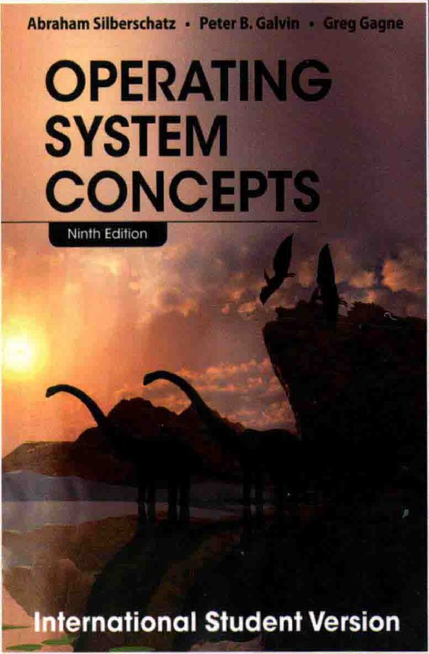

# 
 操作系统概念 

## 
    noted by zyh-hehe   

##  
 BUPT SCS 2022

### 第一章 导论

#### 1.1 操作系统的功能

一. 计算机系统的组件：硬件、操作系统、应用程序、用户

1. 硬件：为系统提供基本的计算资源
2. 应用程序：规定用户为解决计算问题而使用这些资源的方式
3. 操作系统：控制硬件，并协调各个用户应用程序的硬件使用

二. 用户视角

1. 单个用户单独使用资源：优化用户进行的工作。设计主要目的是用户使用方便，次要的是性能，不在乎的是资源利用（如何共享硬件和软件资源）
2. 多个用户共享资源并可以交换信息：设计主要目的是优化资源利用率，确保所有的cpu时间、内存和IO都能得到有效使用，并且确保没有用户使用超过限额以外的资源
3. 工作站模式，工作站和其他工作站和服务器相连，用户不仅可以使用专用资源，而且可以使用网络和服务器的共享资源：设计需要兼顾使用方便性和资源利用率

三. 系统视角

1. 从计算机的角度来看，操作系统是与硬件紧密相连的程序。因此可以将操作系统看作资源分配器。
2. 计算机系统的资源：cpu时间、内存空间、文件存储空间、IO设备等。
3. 控制程序角度：强调控制各种IO设备和用户程序的需求，操作系统作为控制程序管理用户程序的执行，以防止计算机资源的错误或不当使用。特别注重IO设备的运行和控制。

四. 操作系统的定义

1. 一个比较公认的定义是，操作系统是一直运行在计算机上的程序（内核/kernel）。（除了内核外，还有其他的两类程序：系统程序和应用程序。前者是与系统运行有关的程序，但不是内核的一部分；后者是与系统运行无关的所有其他程序）
2. 移动操作系统通常不只有内核，也有中间件，即为应用程序开发人员提供其他功能（如数据、多媒体和图形等）的软件框架。

#### 1.2 计算机系统的组成

一. 计算机系统的运行

1. 现代通用计算机系统包括一个或多个cpu和若干设备控制器，通过公用总线相连而成，该总线提供了共享内存的访问。每个设备控制器负责一类特定的设备。cpu和设备控制器可以并发执行，并且竞争访问内存。为了确保有序访问共享内存，需要内存控制器来协调访问内存。

   

2. 当计算机开始运行时，他需要运行一个初始程序。该初始程序/引导程序一般位于计算机的固件（如ROM或EEPROM）。它初始化系统的各个组件，从cpu寄存器、设备控制器到内存内容。引导程序必须知道如何加载操作系统并且开始执行系统，所以其必须定位操作系统内核并且加到内存。

3. 一旦内核加到内存并执行，它就开始为系统和用户提供服务。除了内核外，系统程序也提供一些服务，它们在启动时加到内存而成为系统进程/系统后台程序，其生命周期与内核一样。对于UNIX，首个系统进程为”init“，它允许许多其他系统后台程序。一旦这个阶段完成了，系统就完全启动了，并且等待事件发生。

4. 事件发生通常通过软硬件的中断来通知。硬件可以随时通过系统总线发送信号到cpu以触发中断，而软件也可通过执行特别操作即系统调用（监督程序调用）以触发中断。

二. 存储结构

三. IO结构

1. 通用计算机系统包括一个或多个cpu和若干设备控制器，通过公用总线相连而成，每个设备控制器负责一类特定的设备。每个设备控制器维护一定量的本地缓冲存储和一组特定用途的寄存器。设备控制器负责在所控制的外围设备与本地缓冲存储之间进行数据传递。操作系统为每个设备控制器提供一个设备驱动程序，该程序负责设备控制器并为操作系统的其他部分提供统一的设备访问接口。
2. 在开始IO时，设备驱动程序加载设备控制器的适当寄存器。相应的，设备控制器检查这些寄存器内容并决定采取什么操作（如读取字符）。控制器开始从设备向本地缓冲区传输数据。一旦完成数据传输，设备控制器就会发出中断表明操作完成，然后驱动程序将控制返回到操作系统。对于读操作，数据或数据指针也会返回；对于其他操作，返回状态信息。
3. DMA：设备控制器可在本地缓冲和内存之间传送整块的数据而无需cpu的干预。

#### 1.3 计算机系统的体系结构

一. 单处理器系统

1. 单处理器系统只有一个主cpu以便执行一个通用指令集，该指令集包括执行用户进程的指令。几乎所有单处理器系统都带有其他专用处理器（如IO处理器等）。这些专用处理器执行有限指令集，而且不执行用户进程。在有的环境下，它们由操作系统管理，操作系统将要做的任务信息发给它们并监控他们的状态。在其他的环境下，专用处理器作为底层组件集成到硬件。操作系统不能和这些处理器通信，但它们可以自主完成任务。要注意的一点是，如果系统只有一个通用cpu，那么就为单处理器系统。

二. 多处理器系统

1. 多处理器系统有两个或多个紧密通信的cpu，它们共享计算机总线，有的还共享时钟、内存和外设等。
2. 多处理器系统的优点：增加吞吐量、规模经济、增加可靠性。
   - 增加吞吐量：通过增加处理器数量，能够在更短时间内完成更多工作。采用N个处理器的加速比小于N（阿姆达尔定律）。
   - 规模经济：多处理器系统可以共享外设、大容量存储和电源供给。
   - 增加可靠性：将功能分布在多个处理器上，单个处理器的失灵不会使整个系统停止，而只会变慢。
3. 适度退化和容错：根据剩余有效硬件的级别按比例提供服务的能力称为适度退化。有的系统超过适度退化，称为容错，因为它们能容忍单个部件错误并且仍然继续运行。容错需要一定的机制来对故障进行检测、诊断和纠错
4. 非对称处理：每个处理器都有各自特定的任务，一个主处理器控制系统，其他处理器或向主处理器要任务或做预先规定的任务。这种方案称为主从关系，即主处理器调度从处理器并安排工作。
5. 对称多处理（SMP）：每个处理器都参与完成操作系统的所有任务。每个处理器都有自己的寄存器集，也有私有或本地缓存；但所有处理器都共享物理内存。

6. 对称和非对称处理的差异可能源于硬件或者软件。特定硬件可以区别多个处理器，软件也可编成选择一个处理器为主，其他的为从。
7. 多处理通过增加cpu来提高计算能力。如果cpu集成了内存控制器，那么增加cpu也能增大系统的内存访问。无论如何，多处理可使系统的内存访问模型从均匀内存访问（UMA）改成非均匀内存访问（NUMA）。对于UMA，cpu访问RAM的所需时间相同；而对NUMA，有的内存访问所需时间更多，这会降低性能。操作系统通过资源管理可以改善NUMA的问题。
8. 多核设计：集成多个计算核到单个芯片。多核比多个单核更加高效，因为单片通信比多个芯片通信更快，且电源消耗更低。要注意的是，多核系统为多处理器系统，但不是所有多处理器系统都是多核的
9. 刀片服务器：将多处理器板、IO板和网络板全部置于同一机箱。和传统多处理器系统不同的是，每个刀片服务器可以独立启动，并且运行各自的操作系统。

三. 集群系统

1. 与多处理器系统不同，集群系统由两个或多个独立系统（或节点）组成。这样的系统是松耦合的，每个节点可为单处理器系统或多核系统。集群系统较为公认的定义是，集群计算机共享存储，并且采用局域网连接或更快的内部连接。
2. 集群通常用于提供高可用性服务，这意味着即使集群中的一个或多个系统出错，仍可继续提供服务。一般来说，通过在系统中增加一定冗余可获取高可用性，每个集群节点都可执行集群软件层，以监视（通过局域网）一个或多个其他节点。如果被监视的机器失效，那么监视机器可以取代存储的拥有权并重启在失效机器上运行的应用程序。用户只会感到短暂的服务中止。
3. 集群可以是对称的或非对称的。对于非对称集群，一台机器处于热备份模式，而另一台运行应用程序，热备份主机只监视活动服务器。对于对称集群，两个或多个主机都运行应用程序并互相监视。这种方式充分使用现有硬件，当有多个应用程序可供执行时，这种结构更为高效。
4. 集群也可以提供高性能计算环境。每个集群的所有计算机可以并发执行一个应用程序，提供更强大的计算能力。这种技术就是并行计算，即将一个程序分为多个部分，而每个部分可以并行运行在计算机或集群计算机的各个核上。每个集群节点解决部分问题，结果合并形成最终解决方案。
5. 其它形式的集群：并行集群允许多个主机访问共享存储的统一数据。

#### 1.4 操作系统的结构

一. 多道程序设计

1. 单个程序不会一直占用cpu和IO设备，多道程序设计通过合理安排作业提高cpu利用率。
2. 操作系统会在内存中保存多个任务，但主存太小不能容纳所有作业，因此这些作业会保存在硬盘的作业池上，等待分配内存。
3. 内存的作业集是作业池的作业集的子集。操作系统可以从其中选择执行一个作业。当这个作业需要等待时，cpu可以简单切换到另一个作业。

二. 分时系统

1. 分时系统又称多任务，是多道程序设计的自然延伸。
2. 还是通过cpu切换作业来执行多个作业，但切换频率很高，用户可以在程序运行时与其交互。
3. 允许多个用户共享一台计算机。由于每个动作一般较短，所以每个用户只需要少量cpu时间。系统在用户之间快速切换，实现了每个用户都感觉整个系统为自己所用。
4. 对于分时系统，操作系统必须确保合理的响应时间。这可以通过交换实现，但更好的实现方式是虚拟内存。

#### 1.5 操作系统的执行

一. 双重模式与多重模式的执行

1. 为了确保操作系统正确运行，必须区分操作系统代码和用户代码的执行。大多数计算机系统采用硬件支持来区分执行模式。

2. 常见的两种单独运行模式是用户模式和内核模式（监视模式、系统模式、特权模式）。硬件可以通过一个模式位（0/1）区分两种模式。执行用户程序时系统处于用户模式，但用户程序通过系统调用请求操作系统服务时，系统就会切换到内核模式。

   

3. 双重模式提供保护的手段是将可能引起损害的机器指令作为特权指令，并且硬件只有在内核模式才能执行这些特权指令。如果在用户模式下试图执行特权指令，硬件不会执行，而是认为其非法并以陷阱形式通知操作系统。操作系统会给出一个适当的出错信息，并倒出程序内存，写到文件以供检查。

4. 特权指令包括切换到用户模式，IO控制，定时器管理和中断管理等。（切换到内核模式是可以由用户程序来执行的，所以不是特权指令）

5. 系统调用有多种方式，但无论哪种方式都是进程请求操作系统执行功能的方法。系统调用会陷入（trap指令）中断向量指定的某个位置。当要执行系统调用时，硬件会将其当成软件中断（陷阱），控制经中断向量转移到系统的中断服务程序。内核检查中断指令（的参数）并判断系统调用类型。请求的其他信息可以通过寄存器、堆栈和内存进行传递。内核检查参数是否合法并执行请求。最后，控制返回到系统调用之后的指令。

二. 定时器

1. 为防止用户程序陷入死循环或在不调用系统服务时不将控制返回到操作系统，操作系统使用了定时器。定时器可设置为在指定周期后中断计算机。周期可以是可变或固定的。
2. 在将控制交到用户之前，操作系统要确保定时器已经设置好以便产生中断。当定时器中断时，控制自动转到操作系统。操作系统可以决定将该中断作为错误处理，或是给程序更多时间。

#### 1.6 进程管理

1. 进程为了完成任务，需要一定的资源，包括cpu时间、内存、文件、IO设备等。这些资源可以在进程创建时赋予，也可以在执行进程时分配。当进程中止时，操作系统会收回所有可以再利用的资源。
2. 程序本身不是进程。程序是一个被动实体，进程是一个主动实体。
3. 进程是系统的工作单元，系统由多个进程组成，包括操作系统进程和用户进程。
4. 操作系统负责以下活动：在cpu上调度进程和线程、创建和删除用户和系统进程、挂起和重启进程、提供进程同步和通信机制。

#### 1.7 内存管理

1. 如果一个程序需要执行，那么它必须映射到绝对地址并加载到内存。随着程序执行，进程可以通过产生绝对地址来访问内存的程序指令和数据。程序终止时它的内存会释放，一边后续程序的加载和执行。
2. 内存管理的方案需要有特定算法以适用于特定场景。每个算法都需要特定的硬件支持。
3. 操作系统负责以下活动：记录内存的哪部分在被使用以及被谁使用、决定哪些进程会调入调出内存、根据需要分配和释放内存空间。

#### 1.8 存储管理

1. 文件管理：创建和删除文件、创建和删除目录（以组织文件）、提供文件和目录的操作原语、映射文件到外存、备份文件到稳定非易失的存储介质
2. 大容量存储器管理：管理空闲空间、存储空间分配、硬盘调度
3. 高速缓存（cache）：慎重选择高速缓存大小和置换策略可以极大提高性能。
4. IO系统：操作系统的目的之一时为用户隐藏具体硬件设备的特性。

#### 1.9 保护与安全

1. 需要有机制确保只有经过操作系统授权，进程才能使用相应资源。这种机制就是保护。
2. 防止系统不受内部或外部攻击时安全德工作。为了阻止攻击，有些系统让操作系统完成，其他系统让策略或额外软件来完成。
3. 保护和安全要求系统能区分所有用户。大多数操作系统采用一个列表，以便维护用户名称及其关联用户标识。也有系统区分用户集合。

### 第二章 操作系统结构

####  2.1 操作系统的服务

1. 操作系统提供环境以便执行程序。有一组服务用于提供用户功能：
   - 用户界面：有多种形式，包括命令行界面、批处理界面和图形用户界面。
   - 程序执行：系统加载程序加载程序到内存并加以运行。程序应能结束运行，无论是正常还是不正常。
   - IO操作：程序运行可能需要IO，操作系统必须提供手段以便执行IO。
   - 文件系统操作：读写文件和目录，创建删除文件，搜索文件，列出文件信息。有些操作系统还提供权限管理。
   - 通信：可以通过共享内存或消息交换实现。
   - 错误检测：操作系统需要不断检测错误和更正错误。有时只能停机，有时可以终结出错进程，或返回出错码。
2. 还有一组操作系统服务是为了确保系统本身运行高效：
   - 资源分配：为多个作业分配资源。
   - 记账：记录用户使用资源的类型和数量。
   - 保护和安全：保护需要确保可以控制系统资源的全部访问。系统安全保证不受内外部攻击。

#### 2.2 用户与操作系统的界面

一. 命令解释程序

1. 命令解释程序允许用户直接输入命令，以供操作系统执行。有的操作系统内核包括命令解释程序，有的操作系统将其当成一个特殊程序，当用户首次登录或一个任务开始时该程序就会运行。对于有多个可选命令解释程序的系统，解释程序称为壳(shell)。
2. 命令解释程序的主要功能是，获取并执行用户指定的下一条命令。这些命令的实现有两种常用方法：
   - 命令解释程序本身包含代码以执行这些命令。对于这种方法，所能提供命令的数量决定命令解释程序的大小。
   - 通过系统程序实现大多数的命令。命令解释程序不必理解命令，只要通过命令确定一个文件以加载到内存并执行。

二. 图形用户界面

1. 利用桌面概念，即采用基于鼠标的视窗和菜单系统。

三、界面的选择

1. 选择命令行界面或GUI主要取决于个人喜好。
2. 用户界面可随系统的不同甚至系统用户的不同而不同，它通常不属于系统内核。

#### 2.3 系统调用

1. 系统调用提供操作系统服务接口。

2. 系统每秒执行成千上万的系统调用，但大多数程序员不会看到这些细节。通常，开发者根据API来设计程序。API为方便应用程序员规定了一组函数，包括每个函数的输入参数和返回值。有三组常见的API：适用于Windows的Windows API、适用于POSIX系统（包括所有版本的UNIX、Linux和OS X）的POSIX API和适用于Java虚拟机的Java API。

3. 在后台，API函数通常为应用程序员调用实际的系统调用。

4. 根据API来编程能够提高程序的可移植性。

5. 对于大多数的程序设计语言，运行时支持系统（函数库）提供了系统调用接口以链接到操作系统的系统调用。系统调用接口截取API函数的调用，并调用所需的系统调用。每个系统调用有一个相关数字，接口根据数字来建立索引列表。

   

   

6. 向操作系统传递参数有三种常用方法：通过寄存器传递参数；将参数存在内存的块或表中，通过寄存器传递地址；将参数压入堆栈，通过操作系统弹出。后两种方式不限制传递参数的数量或长度。

#### 2.4 系统调用的类型

一. 进程控制

1. 执行程序应能正常(end( ))或异常(abort( ))停止执行，如果一个系统调用异常停止当前执行的程序，或程序运行遇到问题并引起错误陷阱，就将内存信息转储到磁盘并生成错误信息，便于纠正错误。无论是正常还是异常情况，操作系统都应将控制转到命令解释程序。
2. 执行一个程序的进程或作业可能需要加载(load( ))和执行(execute( ))另一个程序。这种功能允许命令解释程序来执行一个程序。
3. 创建了新的作业或进程后，可能要等待其执行完成，也可能要等待某个事件的出现。
4. 通常，两个或多个进程会共享数据。为了确保共享数据的完整性，操作系统通常提供系统调用以允许一个进程锁定共享数据。在解锁之前，其他进程不能访问该数据。

二. 文件管理

1. 首先要能创建和删除文件。这两个系统调用需要文件名称和文件的一些属性。
2. 一旦文件创建后，就会打开并使用它，也会读、写、重定位。最后，需要关闭文件。
3. 如果采取目录结构组织文件系统的文件，那么也需要同样的目录操作。
4. 不管是文件还是目录，都要能对各种属性的值加以读取或设置。
5. 有的操作系统还提供其他的系统调用，包括文件复制、移动。

三. 设备管理

1. 进程执行需要一些资源。操作系统控制的各种资源可以看作设备。有的设备是物理设备，有的设备可当作抽象或虚拟的设备。多用户系统要求先请求设备，在设备使用完后要释放它。
2. 在请求并得到设备后，就能像对待文件一样对设备进行读、写、重定位。

四. 信息维护

1. 用于程序与操作系统之间传递信息。
2. 大多数系统都有一个返回当前时间和日期的系统调用。还有的系统调用可以返回系统的其他信息，如当前用户数、操作系统版本和内存或磁盘的可用量等。
3. 还有一组系统调用帮助调试程序，包括转储内存、单步（cpu每执行一条指令都会产生一个陷阱）。
4. 操作系统维护所有进程的信息，可以通过系统调用来访问。

五. 通信

1. 对于消息传递模型，进程通信通过相互交换消息来传递信息。进程间的消息交换可以直接执行，也可通过一个共同邮箱来间接进行。
2. 对于共享内存模型，进程通过系统调用创建共享内存，并访问其他进程拥有的内存区域。
3. 消息传递对少量数据的交换很有用，共享内存在通信方面比较高速和便捷，但在保护和同步方面有问题。

六. 保护

1. 提供保护的系统调用包括设置资源权限和允许或拒绝特定游湖访问某些资源。

#### 2.5 系统程序

1. 系统程序也称为系统工具，为程序开发和执行提供了一个方便的环境。有的系统程序只是系统调用的简单用户接口，有的相当复杂。系统程序可分为：文件管理、状态信息、文件修改、程序语言支持、程序加载与执行、通信、后台服务。
2. 除系统程序外，大多数操作系统提供解决常见问题或执行常用操作的程序，包括网页浏览器、文字处理器、数据库系统、编译器等。

#### 2.6 操作系统的设计与实现

一. 设计目标

1. 用户目标：用户要求系统有一定的优良性能。
2. 系统目标：操作系统应易于设计、实现和维护。

二. 机制和策略

1. 机制决定如何做，策略决定做什么。一个重要原则就是策略和机制的分离。
2. 对于所有的资源分配，策略决定非常重要。只要决定是否分配资源，就应做出策略决定。

三. 实现

1. 早期系统是用汇编语言编写的，现在大部分操作系统用高级语言实现。实际上，操作系统可以由多种语言编写，底层使用汇编语言，高层使用高级语言。
2. 采用高级语言的优势在于代码编写更快、更为紧凑、更容易理解和调试、更容易移植到其他硬件，缺点在于速度的降低和存储的增加。
3. 操作系统的重大性能改善很可能来源于更好的数据结构和算法。

#### 2.7 操作系统的结构

一. 简单结构

1. 利用最小空间而提供最多功能，因此没有仔细地划分成模块。

二. 分层方法

1. 有了适当的硬件支持，操作系统可以分成许多块，这样操作系统可以更好地控制计算机和使用计算机的应用程序。采用自顶向下方法，可先确定总的功能和特征，再划分成模块。
2. 系统的模块化有许多方法，其中一种是分层法，即操作系统分成若干层级。最低层（层0）是硬件，最高层（层N）是用户接口。操作系统层采取抽象对象，以包括数据和操纵这些数据的操作。如层M，包括了数据结构和一组可被更高层调用的程序集，而层M可以调用更低层的操作。

3. 分层法的优点在于简化了构造和调试，因为每层的实现只是利用更低层的操作。
4. 分层法的难点在于如何合理定义各层。由于每层只能利用更低层的功能，因此有必要仔细规划。同时，由于每层都为系统调用增加了额外开销，分层实现的效率会比其他方法较差。

三. 微内核

1. 微内核技术通过从内核中删除所有不必要的部件，而将他们当作系统级与用户级的程序来实现以将内核模块化。这样会使内核较小。
2. 微内核的主要功能是为客户端程序和运行在用户空间的各种服务提供通信。通信是通过消息传递来提供的。
3. 微内核的优点是便于扩展操作系统，因为新服务可以在用户空间内添加；当内核确实需要修改时，所做修改也会很小。而且，微内核的可移植性、安全性和可靠性都更好。
4. 微内核的缺点是，由于增加的系统功能的开销，微内核的性能会受损。

四. 模块

1. 操作系统的设计采取可加载的内核模块形式。内核有一组核心组件，在启动或运行时，内核都可以通过模块链入额外服务。
2. 这种设计的思想是：内核提供核心服务，其他服务可以在内核运行时动态实现。

### 第三章 进程

#### 3.1 进程概念

一. 进程

1. 进程是执行的程序，但不只是程序代码。进程还包括当前活动，如程序计数器的值和处理器寄存器的内容等。另外，进程通常还包括进程堆栈、数据段和堆（进程运行时动态分配的内存）。

2. 虽然两个进程可以与同一程序相关联，但是当作两个单独的执行序列。进程在运行时也经常会生成许多进程。
3. 进程本身也可以作为一个环境，用于执行其他代码。

二. 进程状态

1. 每个进程可能处于以下状态：
   - 新的（new）：进程正在创建。
   - 运行（running）：指令正在执行。
   - 等待（waiting）：进程等待发生某个事件（如IO完成或收到信号）。
   - 就绪（ready）：进程等待分配处理器。
   - 终止（terminated）：进程已经完成执行。
   
   

三. 进程控制块（PCB）

1. 操作系统内的每个进程表示，采用进程控制块（PCB），也称为任务控制块。它包含许多与特定进程相关的信息：

   - 进程状态
   - 程序计数器：进程将要执行的下个指令的地址
   - cpu寄存器
   - cpu调度信息：包括进程优先级、调度队列的指针和其他调度参数
   - 内存管理信息：包括基地址、界限寄存器的值、页表或段表
   - 记账信息：包括cpu时间、实际使用时间、时间期限、记账数据、作业或进程数量
   - IO状态信息：包括分配给进程的IO设备列表、打开文件列表

   

   四. 线程

   1. 许多现代操作系统扩展了进程概念，以便一次能够执行多个线程。在支持线程的系统中，PCB被扩展到包括每个线程的信息。
   2. Linux的PCB采用C语言结构体task_struct来表示。在Linux内核中，所有活动进程的表示都采用task_struct的双向链表。内核采用一个current指针用于指向当前系统正在执行的进程。

#### 3.2 进程调度

   一. 调度队列

1. 进程在进入系统时，会被加到作业队列，这个队列包括系统内的所有进程。
2. 驻留在内存中的、就绪的、等待运行的进程保存在就绪队列上。这个队列通常用链表实现，头节点有两个指针，用于指向链表的第一个和最后一个PCB块；每个PCB块还包括一个指针，指向就绪队列的下一个PCB。
3. 一个共享设备可能会收到多个进程的IO请求，有的进程需要等待。等待特定IO设备的进程列表称为设备队列。每个设备都有自己的设备队列。

4. 进程调度通常用队列图来表示。最初，新进程被加到就绪队列并等待，直到被选中执行或分派。当该进程被分配到cpu并执行时，以下事件可能发生：

   - 进程可能发出IO请求，并被放到IO队列。

   - 进程可能创建一个新的子进程，并等待其终止。

   - 进程可能由于中断而被强制释放cpu，并被放回到就绪队列。

   进程会重复以上循环直到终止，然后从所有队列中删除，其PCB和资源也被释放。

二. 调度程序

1. 进程在整个生命周期中会在各种调度队列之间迁移。操作系统为了调度必须按一定方式从这些队列中选择进程。进程选择通过适当调度器或调度程序来执行。主要有两种调度程序：

   - 长期调度程序：又称作业调度程序，从磁盘的缓冲池中选择进程加到内存以便执行。
   - 短期调度程序：又称cpu调度程序，从准备执行的进程中选择进程并分配cpu。

   这两种调度程序的主要区别是执行频率。短期调度程序必须经常为cpu选择新的进程，通常每100ms至少执行一次，这导致短期调度程序必须快速。长期调度程序执行并不频繁，在新进程的创建之间通常有几分钟间隔。

2. 长期调度程序控制多道程序程度，即内存中的进程数量。长期调度程序应进行认真选择，保证IO密集型和cpu密集型的合理进程组合，以使系统平衡和性能得到优化。

3. 有的系统可能没有或极少采用长期调度程序，如UNIX和WIndows，只是将新进程放在内存供短期调度程序使用。

4. 有的分时系统可能引入一个额外的中期调度程序，其核心思想使可将进程从内存或cpu竞争中移出，从而降低躲到程序程度。之后，进程可被重新调入内存，并从中断处继续执行。这种方案被称为交换。

三. 上下文切换

1. 中断导致cpu从执行当前任务改变到执行内核程序。当中断发生时，系统需要保存当前运行在cpu上的进程的上下文，一百年在处理后能够恢复上下文，即先挂起进程，再恢复进程。进程上下文采用PCB表示。通常，通过执行状态保存保存cpu当前状态（包括模式）；之后，状态恢复重新开始运行。
2. 切换cpu到另一个进程需要保存当前进程状态和恢复另一个进程的状态，这个任务就是上下文切换。当进行上下文切换时，内核会将就进程状态保存在其PCB中，然后加载经调度而要执行的新进程的上下文。
3. 上下文切换的时间是纯粹的开销，因为切换时系统没有做任何有用工作。其典型速度是几毫秒。

#### 3.3 进程运行

一. 进程创建

1. 进程再执行过程中可能创建多个新的进程。创建进程称为父进程，新进程称为子进程。每个新进程可以再创建其他进程，从而形成进程树。

2. 大多数操作系统对进程的识别是采用唯一的进程标识符（pid），这通常是一个整数值。系统内的每个进程都有一个唯一的pid，它可以用做索引，以便访问内核中进程的各种属性。

3. Linux系统中，进程init（pid始终为1）作为所有用户进程的根进程或父进程。一旦系统启动后，init进程可以创建各种用户进程。对于UNIX和Linux系统，我们可以通过ps命令得到一个进程列表。

4. 当一个进程创建子进程时，子进程所需的资源可以从操作系统直接获得，也可以只从父进程那里获得资源子集。父进程可能要在子进程之间分配资源或共享资源，限制子进程只能使用父进程的资源，可以防止创建过多进程，导致系统超载。除了提供各种物理和逻辑资源外，父进程也可能向子进程传递初始化数据或输入。

5. 当进程创建新进程时，可能有两种执行可能：

   - 父进程与子进程并发执行
   - 父进程等待，直到某个或全部子进程执行完。

   新进程的地址空间也有两种可能：

   - 子进程是父进程的复制品，两者有同样的数据和程序
   - 子进程加载另一个新程序

6. 在UNIX中，通过系统调用fork() 可创建新进程。新进程的地址空间复制了原来进程的地址空间，这使得父进程和子进程可以轻松通信。通常，在系统调用fork() 之后，有个进程使用系统调用exec() ，以用新程序来取代进程的内存空间，这破坏了原来程序的内存内容。因此，除非调用exec() 出现了错误，否则不会返回控制。

7. 没有什么可以阻止子进程不调用exec() 而作为父进程的副本来执行。在这种情况下，父进程和子进程会并发执行，并使用同样的代码指令。当然，两者都有各自的数据副本。
8. 在Windows中，进程创建采用Windows API函数CreateProcess() 。它与fork() 不同的地方在于其要求将一个特定程序加载到子进程的地址空间。而且，fork() 不需要传递任何参数，但CreateProcess() 需要传递至少10个参数。

二. 进程终止

1. 当进程完成执行最后语句并通过系统调用exit() 请求操作系统删除自身时，进程终止。这时，进程可以返回状态值（通常为整数0，-1，1等）到父进程（通过系统调用wait() ）。所有进程资源会被操作系统释放。
2. 进程通过适当系统调用可以终止另一进程。通常，只有终止进程的父进程才可以执行这一系统调用。父进程终止子进程的原因有：
   - 子进程使用了超过它所分配的资源
   - 分配给子进程的任务不再需要
   - 父进程正在退出，而且操作系统不允许无父进程的子进程继续执行
3. 有些系统不允许子进程在父进程已终止的情况下存在。对于这类系统，如果一个进程终止（无论正常与否），那么他的所有子进程都应该终止。这种现象被称为级联终止，通常由操作系统来启动。
4. 一个进程终止时，操作系统会释放其资源，但它位于进程表中的条目还在，直到他的父进程调用wait() ，这是因为进程表包含了进程的退出状态（父进程调用wait() 可以获取这个状态值）。但当进程已经终止，而其父进程尚未调用wait() ，这样的进程被称为僵尸进程。所有进程终止时都会过渡到这一状态，但一般都是短暂存在。如果父进程没有调用wait() 就终止，会导致子进程变为孤儿进程。Linux和UNIX的处理方法是进程init定期调用wait() 以便收集任何孤儿进程的退出状态，并释放其pid和进程表条目。

